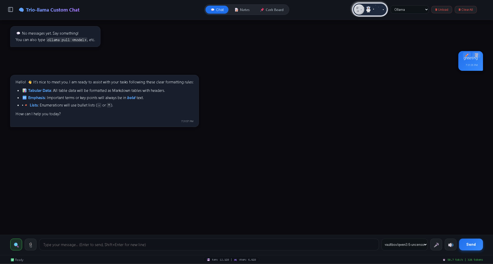
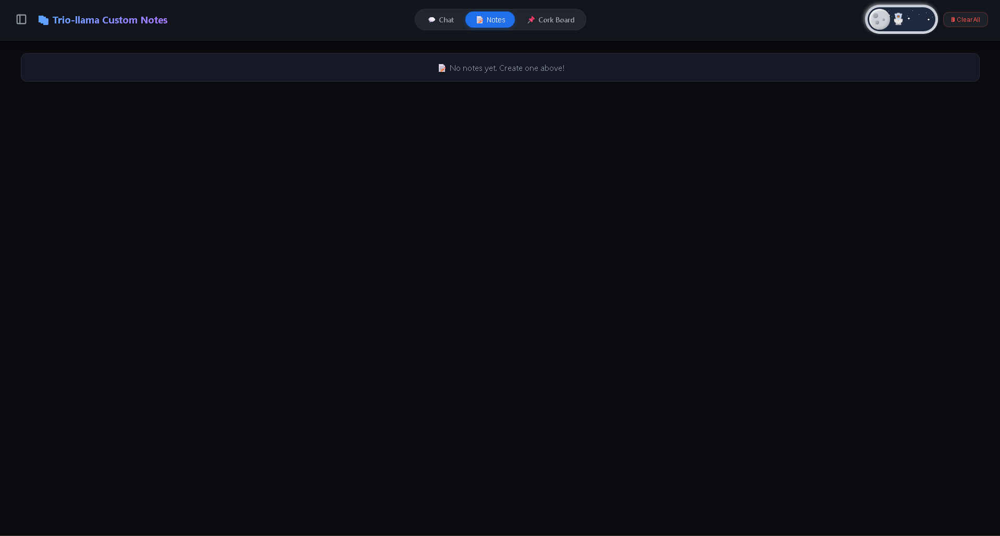
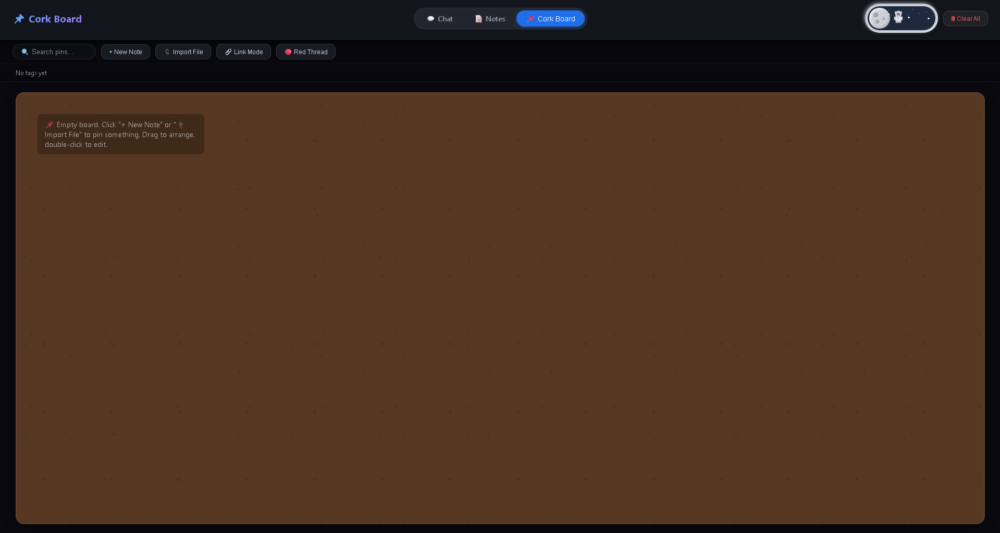

# ⚙️ TrioForge

[](https://opensource.org/licenses/MIT)
[](https://www.python.org/)
[](https://github.com/meowmeowsmh/TrioForge)

> A private, offline-first AI workspace with multi-LLM support, persistent conversations, and SQLite audit logs.  
> **100% free when using Ollama** – no API keys, no limits, no cloud.

---

## ✨ Features

| Feature | Description |
|---------|-------------|
| 🔓 **100% Free** | No API keys, no rate limits—just local models with Ollama. |
| 🧠 **Any Model** | Works with Qwen, Llama, Mistral, DeepSeek, and more. |
| 🌐 **Web Search** | Optional DuckDuckGo integration for up-to-date answers. |
| 🎤 **Voice Input** | Speech-to-text directly in your browser. |
| 📎 **File/Image Upload** | Attach images, PDFs, code files, and text documents. |
| 💾 **Live Monitor** | Real-time RAM & VRAM usage tracking. |
| 🔒 **HTTPS** | Auto-generates SSL certificates on Windows. |
| 🧰 **Multi-Provider** | Supports Ollama, Groq, Hugging Face, DeepSeek, Claude, and llama.cpp. |
| 📑 **Persistent Chats** | Conversations auto-save to `json_configuration/conversations.json`. |
| 🗄️ **SQLite Audit Log** | Every message is logged to `sqlite_data/conversations.db`. Recover deleted chats even after clearing the UI. |
| 🖱️ **Drag & Drop** | Drop files or folders directly onto the chat window. |
| 📝 **Notes & Corkboard** | Built-in study tools for organizing facts and notes. |

---

## 📸 Screenshots





---

## 📦 Prerequisites

- **Python 3.8+** – [Download](https://www.python.org/downloads/)
- **Ollama** – [Download](https://ollama.com) (required for local models)
- **Git** – (optional, for cloning)

---

## 🚀 Quick Start

### 1️⃣ Clone the Repository
```bash
git clone https://github.com/meowmeowsmh/TrioForge.git
cd TrioForge
pip install -r requirements.txt
ollama pull vaultbox/qwen3.5-uncensored:9b
python app.py