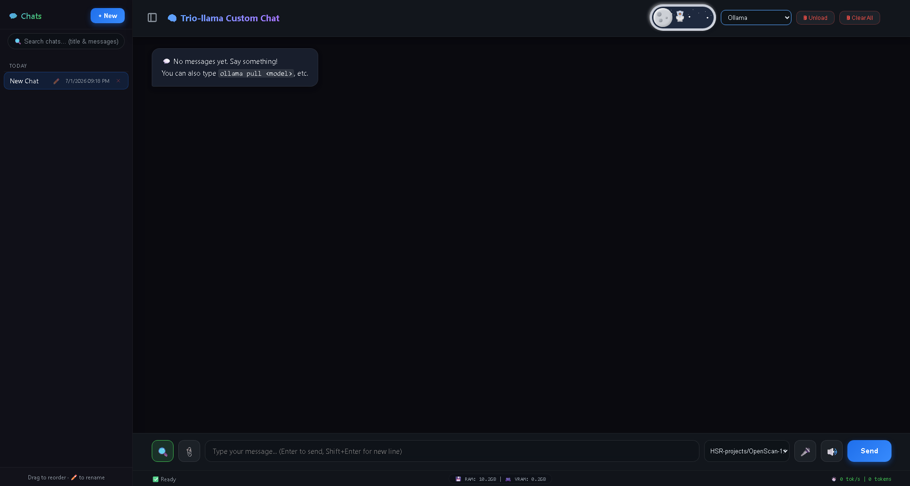

# 🧠 Ollama Custom Chat – with a Fallback Twist

[](https://opensource.org/licenses/MIT)
[](https://www.python.org/)
[](https://github.com/meowmeowsmh/ollama-chat-interface)

> A full‑featured, multi‑conversation chat interface for [Ollama](https://ollama.com) – **100% free**, no API keys, no limits (when using Ollama).  
> Plus, a **clever fallback** that shows a fun 404 page with background music when the backend is down – so you never see a boring “connection refused” again.

Everything auto‑creates itself – just clone, run, and go.

---

## 📖 Table of Contents

- [✨ Features](#-features)
- [📦 Prerequisites](#-prerequisites)
- [🚀 Quick Start](#-quick-start)
- [🛠️ Configuration](#️-configuration)
- [🧠 How the Fallback Works](#-how-the-fallback-works)
- [📁 Project Structure](#-project-structure)
- [💻 Running Manually](#-running-manually)
- [❓ Troubleshooting](#-troubleshooting)
- [🤝 Contributing](#-contributing)
- [📝 License](#-license)
- [🙌 Acknowledgements](#-acknowledgements)

---

## ✨ Features

| Feature | Description |
|---------|-------------|
| 🔓 **100% FREE** | No API keys, no rate limits, no bills – if you stick to **Ollama**. |
| 🧠 **Any Model** | Works with Qwen, Llama, Mistral, DeepSeek, and more. |
| 🌐 **Web Search** | Optional DuckDuckGo search for up‑to‑date answers. |
| 🎤 **Voice Input** | Speech‑to‑text directly in your browser. |
| 📎 **File/Image Upload** | Attach images, PDFs, text files, code files. |
| 💾 **Live Monitor** | Shows RAM & VRAM usage in real time. |
| 🔒 **HTTPS** | Auto‑generates certificates on Windows – just run and go. |
| 🚦 **Smart Fallback** | A built‑in reverse proxy (`fallback.py`) serves a custom `404.html` with a GIF and background music whenever Flask is down. |
| 🎵 **“Troll” 404 Page** | The error page autoplays `Meatball-Parade(chosic.com).mp3` and shows a funny animation – great for pranks or just making downtime more entertaining. |
| 📦 **One‑Click Launcher** | `start.py` launches both the fallback proxy and Flask in separate windows (or tabs), so you never get “connection refused”. |
| 🧰 **Multi‑Provider Support** | Besides Ollama, you can also use Groq, Hugging Face, DeepSeek, Claude, and llama.cpp – just add your API key. |
| 📑 **Persistent Conversations** | Chats are automatically saved in `json_configuration/conversations.json` – you can rename, delete, and reorder them. |
| 🖱️ **Drag‑and‑Drop File Upload** | Drop files or folders directly onto the chat to attach them. |

---

## 📦 Prerequisites

Before you begin, ensure you have the following installed:

- **Python 3.8+** – [Download](https://www.python.org/downloads/)
- **Ollama** – [Download](https://ollama.com) (required for local models)
- **Git** – (optional, for cloning)

---

## 🚀 Quick Start

to this: 

## second update 

## 3 massive update

### 1️⃣ Clone the Repository
```bash
git clone https://github.com/meowmeowsmh/ollama-chat-interface.git
cd ollama-chat-interface
#ensure to download all requirement 
pip install -r requirements.txt
#to run the real application(ensure to get certificate): 
python app.py 
#to run fully integrated 
python start.py