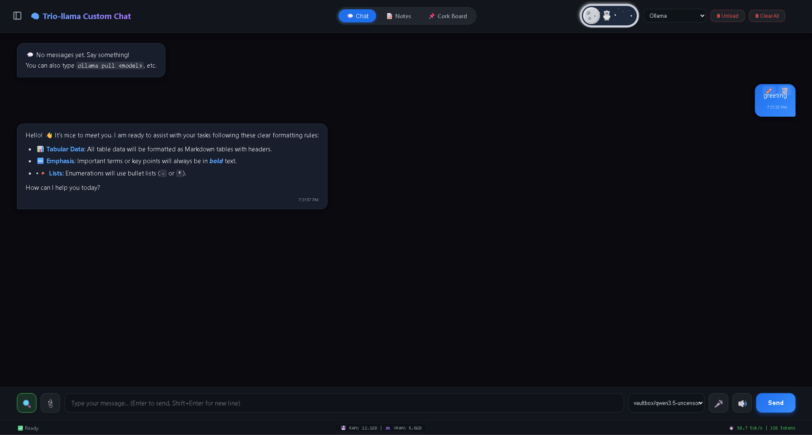
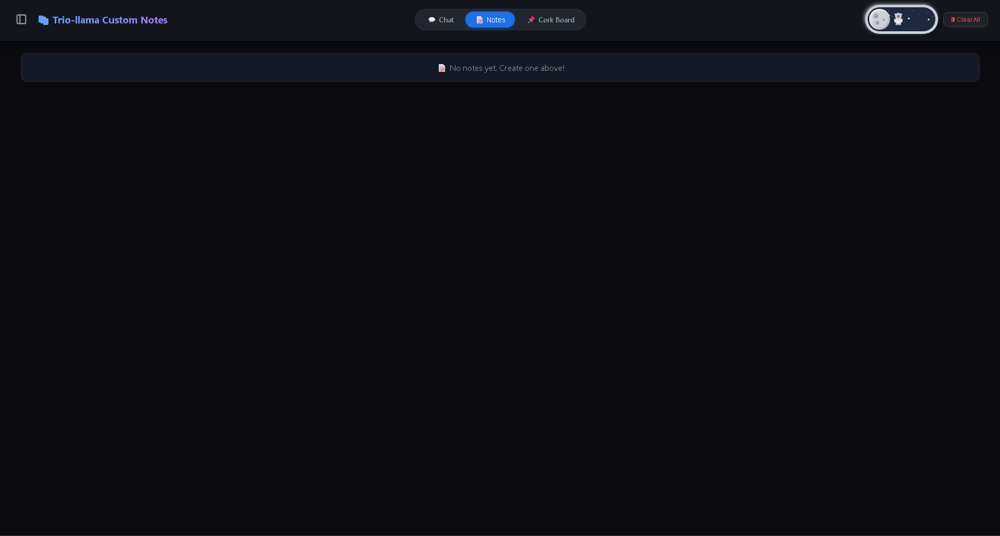
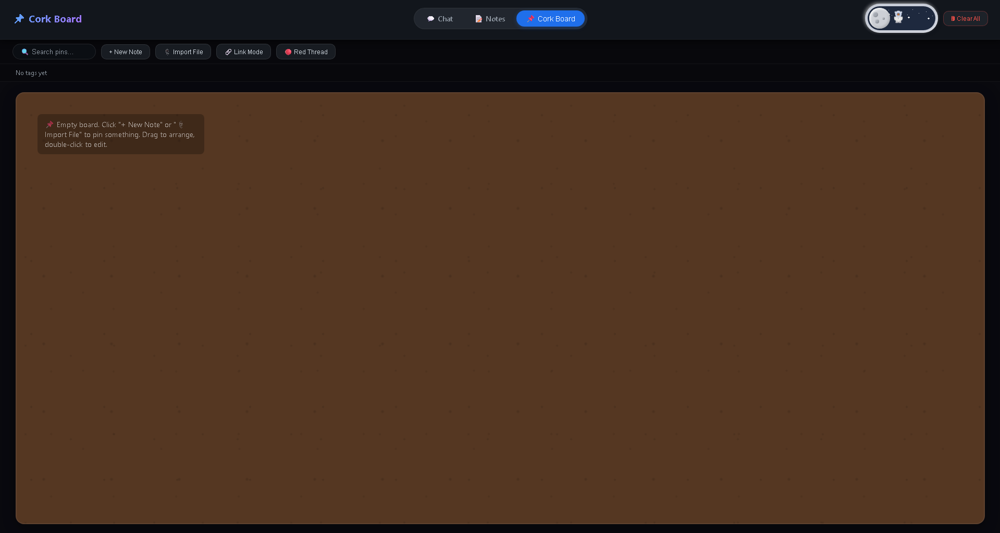

# ⚙️ TrioForge

> **Your own private, free AI workspace.** Chat with any local model, organize notes, and plan ideas on a corkboard — all on **your machine**, all **offline-first**, all **free with Ollama**.

[](https://opensource.org/licenses/MIT)
[](https://www.python.org/)
[](https://github.com/meowmeowsmh/TrioForge)

---

## 💡 Why TrioForge? (instead of ChatGPT)

| | TrioForge | Typical cloud AI |
|---|---|---|
| 🔒 **Privacy** | Your chats stay on **your machine**. | Your chats go to their servers. |
| 💸 **Cost** | **$0** with local Ollama models. | Subscription or per-token fees. |
| 📴 **Offline** | Chat works with **no internet** (local models). | Requires a connection. |
| 🧠 **Your models** | Qwen, Llama, Mistral, DeepSeek — you pick. | Fixed to whatever they offer. |
| 🗂️ **All-in-one** | Chat **+** notes **+** corkboard in one app. | Just chat. |
| ⚙️ **Open & yours** | Self-host, inspect, and extend it. | Closed black box. |

**Bottom line:** if you care about privacy, money, or running your own models, TrioForge is the free, self-hosted alternative.

---

## 🎯 Who it's for

- **Privacy-conscious users** who don't want their conversations in the cloud.
- **Self-hosters** who like running their own tools on their own hardware.
- **Budget users** who want a capable AI assistant without a subscription.
- **Students & researchers** who want chat plus a personal knowledge base (notes + corkboard).
- **LLM hobbyists** who want to switch between local models freely.

---

## 📸 See it in action

| Chat | Notes | Corkboard |
|------|-------|-----------|
|  |  |  |

---

## ✨ Features

- 🔓 **100% free** — no API keys, no limits when using local Ollama models.
- 🧠 **Any local model** — Qwen, Llama, Mistral, DeepSeek, and more.
- 🧰 **Multi-provider** — Ollama, Groq, Hugging Face, DeepSeek, Claude, and llama.cpp.
- 🌐 **Optional web search** — DuckDuckGo integration for up-to-date answers.
- 📎 **File & image upload** — attach images, PDFs, code files, and documents.
- 🎤 **Voice input** — speech-to-text directly in your browser.
- 🖱️ **Drag & drop** — drop files or folders onto the chat window.
- 📑 **Persistent chats** — conversations auto-save and survive restarts.
- 🗄️ **SQLite audit log** — every message is logged; recover deleted chats.
- 📝 **Notes & corkboard** — built-in tools for organizing facts and ideas.
- 💾 **Live monitor** — real-time RAM & VRAM usage tracking.
- 🔒 **HTTPS** — auto-generates SSL certificates on Windows.

---

## 🚀 Quick Start

```bash
# 1. Clone the repository
git clone https://github.com/meowmeowsmh/TrioForge.git
cd TrioForge

# 2. Install dependencies
pip install -r requirements.txt

# 3. Pull a local model (or any model you prefer)
ollama pull vaultbox/qwen3.5-uncensored:9b
# ...e.g. `ollama pull llama3.2` or `ollama pull qwen2.5` also work

# 4. Run the app
python app.py
```

Then open **https://localhost:5001/** in your browser.

> **Tip:** if the app starts in plain HTTP (no certificates), use **http://localhost:5001/** instead.

---

## ⚙️ Configuration

Configuration is done through environment variables — all optional, the app works out of the box with Ollama.

| Variable | Purpose | Default |
|----------|---------|---------|
| `OLLAMA_BASE_URL` | Ollama server URL | `http://127.0.0.1:11434` |
| `GROQ_API_KEY` | Groq provider key | *(unset)* |
| `DEEPSEEK_API_KEY` | DeepSeek provider key | *(unset)* |
| `ANTHROPIC_API_KEY` | Claude provider key | *(unset)* |
| `OLLAMA_REGISTRY_TOKEN` | Token for `ollama push` | *(unset)* |

API keys can also be entered directly in the web UI. Keys are never written to disk.

---

## 🔒 Running with HTTPS

### Windows / macOS — Waitress

`python app.py` auto-generates SSL certificates (via **mkcert**) and serves HTTPS on port 5001. You can also run the dedicated Waitress entry point:

```bash
python https_guni_n_waitress.py
```

### Linux / Docker — Gunicorn

```bash
gunicorn -c gunicorn_conf.py app:app
```

> Gunicorn relies on `fork()`, so it runs natively on Linux/WSL2, not Windows.

---

## 🐳 Docker

```bash
docker compose build     # build the image
docker compose up -d     # start in detached mode
docker compose logs -f   # follow the logs
```

Then open **https://localhost:5001/**.

---

## 🗂️ Where your data lives

| Path | What's stored |
|------|---------------|
| `json_configuration/` | Conversations, notes, model config, attachments |
| `sqlite_data/` | SQLite databases (chat history, notes, corkboard) |
| `cert_store/` | Auto-generated SSL certificates |
| `static/uploads/` | Uploaded images/files |

All of the above are **git-ignored** — every user keeps their own data private.

---

## 🧱 Project structure

```
TrioForge/
├── app.py                    # Main Flask app + chat/conversation routes
├── llm_providers.py          # LLM provider abstraction (Ollama, Groq, DeepSeek, …)
├── notes.py                  # Notes blueprint (Obsidian-style knowledge base)
├── cork_board.py             # Corkboard blueprint (pins, links, AI assist)
├── common.py                 # Shared JSON / SQLite / embedding helpers
├── zoompicleftandright.py    # Image viewer blueprint
├── templates/
│   └── index.html            # Frontend (HTML/CSS/JS)
├── static/                   # Static vendor assets (highlight, mermaid, …)
├── json_configuration/       # User data (git-ignored)
├── sqlite_data/              # SQLite databases (git-ignored)
├── https_guni_n_waitress.py  # Waitress + HTTPS entry point
├── gunicorn_conf.py          # Gunicorn configuration (Linux)
├── Dockerfile / docker-compose.yml
└── requirements.txt
```

---

## 📄 License

Released under the [MIT License](LICENSE).
