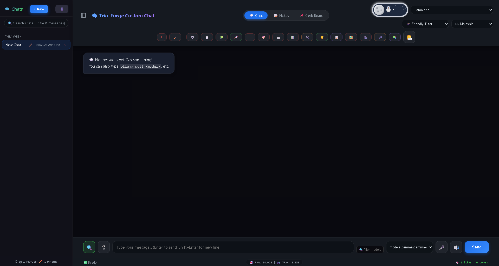
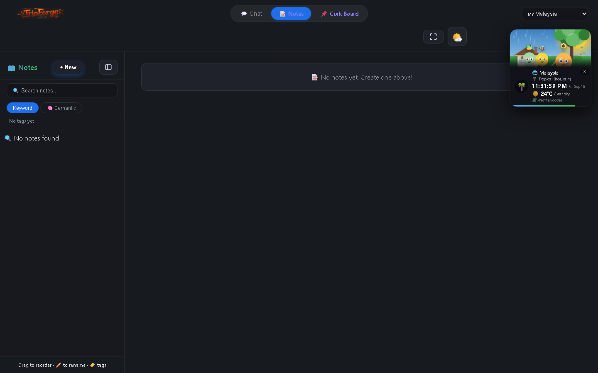
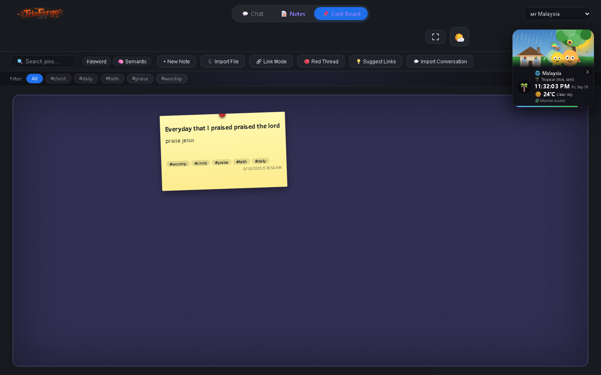

# ⚙️ TrioForge

> **Your own private, free AI workspace.** Chat with any local model, organize notes, and plan ideas on a corkboard — all on **your machine**, all **offline-first**, all **free with Ollama**.

[](https://opensource.org/licenses/MIT)
[](https://www.python.org/)
[](https://github.com/meowmeowsmh/TrioForge)

---

## 💡 Why TrioForge? (instead of ChatGPT)

| | TrioForge | Typical cloud AI |
|---|---|---|
| 🔒 **Privacy** | Your chats stay on **your machine**. | Your chats go to their servers. |
| 💸 **Cost** | **$0** with local Ollama models. | Subscription or per-token fees. |
| 📴 **Offline** | Chat works with **no internet** (local models). | Requires a connection. |
| 🧠 **Your models** | Qwen, Llama, Mistral, DeepSeek — you pick. | Fixed to whatever they offer. |
| 🗂️ **All-in-one** | Chat **+** notes **+** corkboard in one app. | Just chat. |
| ⚙️ **Open & yours** | Self-host, inspect, and extend it. | Closed black box. |

**Bottom line:** if you care about privacy, money, or running your own models, TrioForge is the free, self-hosted alternative.

---

## 🎯 Who it's for

- **Privacy-conscious users** who don't want their conversations in the cloud.
- **Self-hosters** who like running their own tools on their own hardware.
- **Budget users** who want a capable AI assistant without a subscription.
- **Students & researchers** who want chat plus a personal knowledge base (notes + corkboard).
- **LLM hobbyists** who want to switch between local models freely.

---

## 📸 See it in action

| Chat | Notes | Corkboard |
|------|-------|-----------|
|  |  |  |

---

## ✨ Features

- 🔓 **100% free** — no API keys, no limits when using local Ollama models.
- 🧠 **Any local model** — Qwen, Llama, Mistral, DeepSeek, and more.
- 🧰 **Multi-provider** — Ollama, Groq, Hugging Face, DeepSeek, Claude, and llama.cpp.
- 🌐 **Optional web search** — DuckDuckGo integration for up-to-date answers.
- 📎 **File & image upload** — attach images, PDFs, code files, and documents.
- 🎤 **Voice input** — speech-to-text directly in your browser.
- 🖱️ **Drag & drop** — drop files or folders onto the chat window.
- 📑 **Persistent chats** — conversations auto-save and survive restarts.
- 🗄️ **SQLite audit log** — every message is logged; recover deleted chats.
- 📝 **Notes & corkboard** — built-in tools for organizing facts and ideas.
- 💾 **Live monitor** — real-time RAM & VRAM usage tracking.
- 🔒 **HTTPS** — auto-generates SSL certificates on Windows.

---

## 🆕 Recently added

- 🧠 **Assistant personas** — pick from presets (🎓 Friendly Tutor, 💻 Code Mentor, 📊 Professional Analyst) or write your own **✏️ Custom** persona. Applies across **Chat**, **Notes**, and **Cork Board**, and remembers your choice.
- 🎭 **Persona vs default voice** — the persona voice is used for **API-key providers** (Groq / Hugging Face / DeepSeek / Claude), while **local providers** (Ollama / llama.cpp) speak with the default assistant voice — so each bot sounds the way you'd expect.
- 🖥️ / ☁️ **Local vs API badge** — every bot reply shows a small pill so you can instantly tell whether it came from a **local model** or an **API-key model**, even after a reload.
- 🔑 **Cross-page key/provider persistence** — your selected provider, model, and API key now carry over between Chat, Notes, and Cork Board (shared localStorage) and survive reloads.
- 🧾 **Clear error messages** — service errors are classified instead of raw codes: invalid/missing key (401), payment/credit (402), rate limit (429), server error (5xx), timeout, or unreachable — shown in the message area with a **Paid (API)** / **Free (local)** tag.
- 🧹 **Ollama memory cleanup** — switching models now unloads the previous model first, so RAM/VRAM stops stacking up.
- 💬 **Circular loading spinner** — a clean rotating spinner while the bot is generating.
- 👤 **User & bot profiles** — click an avatar to open a profile popup with a profile picture, optional name, bio, gender, born-at, and stay-at fields. Reset the image back to default any time.

---

## 🚀 Quick Start

```bash
# 1. Clone the repository
git clone https://github.com/meowmeowsmh/TrioForge.git
cd TrioForge

# 2. Install dependencies
pip install -r requirements.txt

# 3. Pull a local model (or any model you prefer)
ollama pull vaultbox/qwen3.5-uncensored:9b
# ...e.g. `ollama pull llama3.2` or `ollama pull qwen2.5` also work

# 4. Run it — see "▶️ How to run" below (pick the file for your OS)
```

Then open **https://localhost:5001/** in your browser.

> **Tip:** if the app starts in plain HTTP (no certificates), use **http://localhost:5001/** instead.

### ⬇ Downloading a GGUF model from Hugging Face

You can download any GGUF model straight into the app without leaving the UI:

1. Click the **⬇** button in the top bar.
2. Enter the **repo id** (e.g. `bartowski/Qwen2.5-7B-Instruct-GGUF`).
3. Enter the **GGUF filename** (e.g. `Qwen2.5-7B-Instruct-Q4_K_M.gguf`).
4. Optionally enter a matching **mmproj** filename for vision models (e.g. `mmproj-Qwen2.5-7B-Instruct-BF16.gguf`).

The file(s) land in `models/` and appear in the **llama.cpp** dropdown — ready to run locally (including workspace tools). The download is non-blocking and you'll see the result in the status bar.

---

## ▶️ How to run — which file do I use?

There are three launch files, but you only ever need **one**. Pick by your operating system:

| Your OS | Use this file | How |
|---------|---------------|-----|
| 🪟 **Windows** | `application.bat` | Double-click it |
| 🐧 **Linux / macOS / WSL** | `run.sh` | Run `./run.sh` in a terminal (first time: `chmod +x run.sh`) |
| 🛠️ Any OS (advanced) | `launcher.py` | `python launcher.py` |

> **They all do the exact same thing.** `application.bat` and `run.sh` are just thin wrappers that call `launcher.py`, which auto-detects your OS, installs dependencies if needed, and starts the app.
>
> So the simple rule:
> - **Windows users → double-click `application.bat`**
> - **Everyone else → run `./run.sh`**
>
> You can ignore the other two files.

The launcher also shows a small menu (Run on Windows / Run on Linux-macOS-WSL / Auto-detect / Quit) so you can pick how to start it.

---

## ⚙️ Configuration

Configuration is done through environment variables — all optional, the app works out of the box with Ollama.

| Variable | Purpose | Default |
|----------|---------|---------|
| `OLLAMA_BASE_URL` | Ollama server URL | `http://127.0.0.1:11434` |
| `GROQ_API_KEY` | Groq provider key | *(unset)* |
| `DEEPSEEK_API_KEY` | DeepSeek provider key | *(unset)* |
| `ANTHROPIC_API_KEY` | Claude provider key | *(unset)* |
| `OLLAMA_REGISTRY_TOKEN` | Token for `ollama push` | *(unset)* |

API keys can also be entered directly in the web UI. Keys are never written to disk.

---

## 🗂️ Workspaces & folder access

Workspaces let a model **read and write files on your machine**, scoped to one folder you choose. A workspace has just four fields:

| Field | Purpose |
|-------|---------|
| **Folder** | The folder the model can access (e.g. `D:\TrioForge`). |
| **Folder access** | `read` (list + read only) or `readwrite` (also write). |
| **Thinking** | `low` / `mid` / `high` effort hint. |
| **Dependencies** | Optional dependency notes for the model. |

The model can call three workspace tools:

- `list_files` — list what's in the folder
- `read_file` — read a text file inside the folder
- `write_file` — write a text file (only when folder access is `readwrite`)

> 🔒 **Path safety:** every file path is resolved against the configured folder, and `..` traversal outside that folder is blocked.

### Which providers support it

| Provider | Workspace tools |
|----------|-----------------|
| Ollama | ✅ (chat + streaming) |
| llama.cpp (local GGUF) | ✅ |
| DeepSeek | ✅ |
| Groq | ✅ |

> ⚠️ Tool reliability depends on the model. For llama.cpp, **Qwen3.5** handles tools well; small models (e.g. 1B) often emit malformed tool calls.

Just ask naturally — e.g. *"read py/app.py"* or *"create a file notes.txt with this content"* — and the model will call the tools for you.

---

## 🔒 Running with HTTPS

### Windows / macOS — Waitress

`python py/app.py` auto-generates SSL certificates (via **mkcert**) and serves HTTPS on port 5001. You can also run the dedicated Waitress entry point:

```bash
python py/https_guni_n_waitress.py
```

### Linux / Docker — Gunicorn

```bash
gunicorn -c py/gunicorn_conf.py py.app:app
```

> Gunicorn relies on `fork()`, so it runs natively on Linux/WSL2, not Windows.

---

## 🐳 Docker

```bash
cd docker
docker compose build     # build the image
docker compose up -d     # start in detached mode
docker compose logs -f   # follow the logs
```

Then open **https://localhost:5001/**.

---

## 🗂️ Where your data lives

| Path | What's stored |
|------|---------------|
| `json_configuration/` | Conversations, notes, model config, attachments |
| `sqlite_data/` | SQLite databases (chat history, notes, corkboard) |
| `cert_store/` | Auto-generated SSL certificates |
| `static/uploads/` | Uploaded images/files |

All of the above are **git-ignored** — every user keeps their own data private.

---

## 🧱 Project structure

```
TrioForge/
├── py/                          # ← all Python code
│   ├── app.py                   # Main Flask app + chat/conversation routes
│   ├── common.py                # Shared JSON / SQLite / embedding helpers
│   ├── paths.py                 # Project-root path helper
│   ├── providers/
│   │   └── llm_providers.py     # LLM provider abstraction (Ollama, Groq, DeepSeek, …)
│   ├── features/
│   │   ├── notes.py             # Notes blueprint (Obsidian-style knowledge base)
│   │   ├── cork_board.py        # Corkboard blueprint (pins, links, AI assist)
│   │   └── viewer.py            # Image viewer blueprint
│   ├── tools/
│   │   ├── launcher.py          # Cross-platform launcher
│   │   └── voice_agent.py       # Local voice-to-voice agent launcher
│   ├── https_guni_n_waitress.py # Waitress + HTTPS server (Windows)
│   └── gunicorn_conf.py         # Gunicorn server config (Linux)
├── docker/                      # ← Docker files
│   ├── Dockerfile
│   ├── docker-compose.yml
│   └── docker-entrypoint.sh
├── application.bat              # Windows launcher (double-click)
├── run.sh                       # Linux / macOS / WSL launcher
├── voice_agent.bat              # Voice agent launcher (double-click)
├── templates/
│   └── index.html               # Frontend (HTML/CSS/JS)
├── static/                      # Static vendor assets (highlight, mermaid, …)
├── models/                      # Ollama Modelfile + instruction (GGUF weights git-ignored)
├── voiceguide_llama.cpp_guide/  # Voice agent config + logs (logs git-ignored)
├── json_configuration/          # User data (git-ignored)
├── sqlite_data/                 # SQLite databases (git-ignored)
├── cert_store/                  # Auto-generated SSL certificates (git-ignored)
├── requirements.txt / README.md / LICENSE / SECURITY.md / Disclaimer.md / CODE_REVIEW.md
└── .gitignore / .dockerignore
```

---

## 📄 License

Released under the [MIT License](LICENSE).
