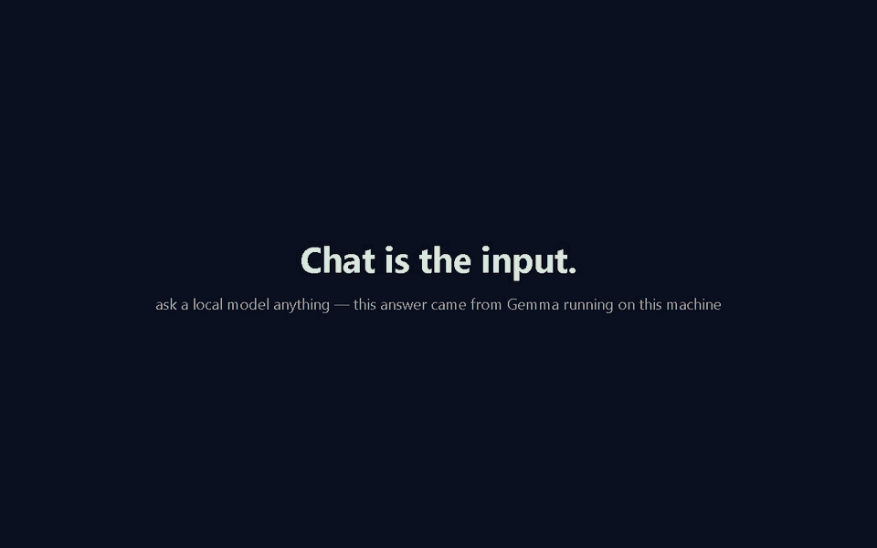

# ⚙️ TrioForge

> ### Chat is the input. The board is the output.
>
> TrioForge is a **self-hosted AI workspace where a conversation becomes something you keep**: send any answer to the corkboard, let the model rewrite it there, link it to what you already know. Chat, notes and pins live in one app, on your machine — offline-first, free with Ollama, no account, no telemetry.



*Real session with a local model: ask → **Import Conversation** turns the answer into a pin → **✨ AI Assist → Improve Writing** rewrites it on the board → link it to a related pin. (The model's ~20s rewrite is sped up here.)*

**Everything else it does** — local + API models (Ollama, llama.cpp, Groq, DeepSeek, Claude, Gemini, OpenRouter), a file-editing agent with a live diff panel, full-text search over every message, export/import, local voice-to-voice, document chat (RAG), image/video generation, Windows/macOS/Linux/WSL + Docker, installable on your phone. → [full feature list](#-features) · [screenshots](#-see-it-in-action)

**Opens in your browser — or in its own window.** On Windows, double-click **`TrioForge.bat`** and TrioForge opens in your default browser, with the server running hidden behind it: the light, always-stable way. Want a real window of its own — its own icon and title, no browser tabs, no address bar? Add **`--window`** to the same file, and if the embedded engine cannot draw on your GPU TrioForge hands the app to your browser by itself. On your phone or another machine the same app serves the web interface, and there is **no .exe to download**: it's the repo (or Docker), so nothing to install and no SmartScreen dialog.

[](https://opensource.org/licenses/MIT)
[](https://www.python.org/)
[](https://github.com/meowmeowsmh/TrioForge)

**Why it exists:** most tools make you pick one — a chat UI, *or* a notes app, *or* a whiteboard. Chat is where you think; a board is where you keep what you thought. TrioForge is the only one that connects them, and everything stays on your disk.

**Jump to:** [60-second start](#-start-in-60-seconds) · [Quick start](#-quick-start) · [Model folders](#️-model-folders-automatic-projector-pairing) · [Features](#-features) · [Configuration](#️-configuration) · [Top-bar panels](#️-the-top-bar-panels) · [Workspaces](#️-workspaces--folder-access) · [Search, export & titles](#-search-export--titles) · [Generation](#-image-video--audio-generation) · [ComfyUI](#-comfyui-setup-optional--for-free-local-generation) · [HTTP vs HTTPS](#-http-vs-https) · [Remote access](#-remote-access-phone--lan--tunnel) · [Docker](#-docker) · [Your data](#️-where-your-data-lives) · [Project structure](#-project-structure) · [License](#-license)

---

## 🆕 What's new in 1.0.3 — the stability release

**1.0.3 is about things that were quietly broken.** Every fix here came out of a real
failure on a real machine, and each one was verified against the files that broke it —
including a **72-minute, 563 MB meeting recording** that no previous version could even
accept.

### Audio and video now work end to end

| what was wrong | what 1.0.3 does |
|---|---|
| **Big attachments could never be sent.** Attachments travelled as base64 inside the chat request, whose body is capped at 25 MB — so anything over ~18 MB was rejected with a 413, and a 563 MB recording arrived empty. | Large files **stream to disk** and are read by path. A 563 MB recording now uploads in ~3 s. |
| A **2013 ffmpeg** on `PATH` silently failed on modern formats, while the app blamed a missing install. | TrioForge **installs its own current ffmpeg** (`⚡ Install ffmpeg` → `tools/ffmpeg`), prefers it over `PATH`, and logs which build each conversion used. |
| Every failure said *"is ffmpeg installed?"* — usually a lie. | Errors now name the real cause: the file, the codec, a missing audio track, or a model that answered with nothing (with ffmpeg's own message). |
| Transcription ran **one 30-second chunk at a time** while llama-server had **4 idle slots**. A 72-minute recording took ~48 minutes. | Chunks are transcribed **4 at a time**: ~12 minutes for the same file. |
| The model was **unloaded 5 minutes after it started** — mid-chat, mid-transcription — because nothing ever refreshed the idle timer. | Every request and every chunk counts as use, so a long job is never cut off. |
| A universal model reads audio **and** images, but the app picked one and **silently dropped the other**. | It now answers about **both**, in one request. |
| **~150 cmd windows** flashed across the screen while a long recording was processed (every ffmpeg run was spawned without `CREATE_NO_WINDOW`). | Every ffmpeg/`ollama`/`nvidia-smi` spawn is windowless. |

### The window opens where it can actually draw

- **WebView2's compositor can fail on some GPUs**: the page loads and its JavaScript runs,
  but the window paints blank white. 1.0.3 **samples the window's own pixels**, and when it
  is blank (or frozen) it **opens the app in your browser** and records the hang so the next
  start avoids it. A frozen window is replaced when you open the app again, instead of
  silently doing nothing.
- **The browser is the recommended default** — it always renders and uses less memory
  (~150–300 MB versus ~600 MB for the embedded engine). You get both shortcuts, each created
  only if missing: **`TrioForge`** (browser) and **`TrioForge (window)`**.
- **Closing the window stops only the server *it* started**, so it can no longer kill the
  session your browser is using. Logging in starts a **quiet background server** and opens
  nothing.
- **Your settings survive a profile reset.** Theme, provider, model, persona, API keys and
  last view used to live only inside the WebView2 profile, and a reset wiped them. They are
  mirrored server-side now and restored on load.

**Plus ~10 further bugs** fixed in the attachment pipeline, the launcher and the window
lifecycle — including a crash in the short-audio fallback, and a process kill that could
leave the server holding its port after a frozen window.

### The interface is dark — and it is yours to change

**1.0.3 settles the look.** The app used to carry two palettes and a moon/sun switch, and
the two drifted apart: a header from one and a toolbar from the other, on the same page.
There is **one dark interface now**, in every theme, and the light theme is gone.

- **Seven dark themes, plus your own.** 🎨 in the top bar switches between **Midnight** (the
  original), **Premium** (softer, roomier, indigo), **Galaxy** (deep space and aurora),
  **Odyssey**, **Ember**, **Forest**, **Sakura** — and **Custom**, where you choose the two
  accents and the background yourself. Dark themes only, deliberately.
- **One stylesheet drives all three screens** (`static/themes.css`). Chat, Notes and Cork
  Board read the same variables, so a theme can never apply to one screen and miss another.
- **Your choice is written to both places** — the browser and the app's saved settings — so
  it survives a cleared profile instead of snapping back to the default.
- **Notes and sticky notes stay readable**: pins draw their own light paper (yellow, blue),
  so their text stays dark in every theme rather than inheriting the theme's near-white.
- **One origin.** `localhost:5003` redirects to `127.0.0.1:5003`: a browser keeps a separate
  cache, service worker and storage per origin, so the two names could run two different
  versions of the app at once. Now they cannot.

Want to check what your copy is really rendering? Add **`?tfdebug=1`** to any page — it
reports the computed colour of every important surface, and the count of surfaces painted
the wrong way for the active theme, straight into the page's HTML.

> ### Is it stable? Yes — and where it can't be, it says so and gets out of the way.
>
> The **browser path is rock solid**: it is a local web app, and the browser is the one piece of
> software on your machine that is already debugged. The **optional desktop window** is the only
> part that depends on your GPU driver, so it now watches itself: it checks whether it actually
> painted, notices when it stops responding, and hands you the browser instead of leaving a blank
> window — then remembers, so the next start avoids the same path.
>
> And the failures that used to be silent now speak: a missing codec names the file, a model that
> was unloaded says so instead of "connection refused", an attachment that never arrived is
> reported instead of sent empty. Everything is in the chat **and** in `logs/`.

---

## ⚡ Start in 60 seconds

**Windows — one file to double-click: `TrioForge.bat`.**

```bash
git clone https://github.com/meowmeowsmh/TrioForge.git
cd TrioForge
```

then double-click **`TrioForge.bat`**. That is the whole instruction: there is exactly one launcher,
so there is nothing to choose between.

It opens in your default browser and the server runs hidden behind it — the stable, lighter way, and
the one to use if your GPU driver is fussy (see *Window or browser?* below): a browser tab always
renders. Nothing flashes — the launcher hands over to a hidden copy of itself and closes.

> **It makes its own shortcuts.** TrioForge puts a **TrioForge** icon where your platform keeps them —
> per-user, no admin rights, nothing machine-wide, and only if it is missing:
>
> | platform | what it creates |
> |---|---|
> | **Windows** | Desktop + Start Menu `.lnk` — **`TrioForge`** (browser) and **`TrioForge (window)`** |
> | **Linux (Mint, Ubuntu, …)** | `~/.local/share/applications/trioforge.desktop` + one on your Desktop |
> | **macOS** | A double-clickable **`TrioForge.command`** on your Desktop (Finder can't launch a `.desktop` file) |
> | **WSL** | **Nothing** — WSL has no desktop of its own; you reach the app through Windows at the URL it prints |
>
> Each mode keeps its own up to date: a plain launch makes sure the browser one exists, `--window`
> makes sure the window one does, and neither overwrites the other — both shortcuts point at the same
> `TrioForge.bat` and differ only by that argument. Manage them with
> `TrioForge.bat --install-shortcut` / `--remove-shortcut`, or skip the whole thing with
> `TRIOFORGE_NO_SHORTCUT=1`.

**Want its own window instead?** One flag — from a terminal in the same folder:

```bat
TrioForge.bat --window
```

TrioForge opens in a window of its own — its name in the title bar and taskbar, no tabs, no address
bar — with chat, notes and the corkboard inside it, and the server hidden behind it.

> **How the window works:** it renders with **WebView2**, the engine Windows 10/11 already ships
> (the component Edge uses), embedded by [pywebview](https://pywebview.flowrl.com/) — one ~1 MB
> dependency the launcher installs for you on first run. Your interface stays the same HTML app;
> it simply has a real window instead of browser chrome. Nothing is fetched from the internet, and
> because nothing arrives as a compiled binary there is **no .exe, no installer and no
> SmartScreen dialog**.
>
> **If the window cannot draw, you still get the app.** WebView2's compositor can fail on some GPU
> drivers: the page loads and runs, but the window paints blank. TrioForge checks the window's own
> pixels at start-up, and when it is blank — or frozen — it opens the app in your browser instead and
> remembers, so the next start avoids the same path.

> **Window or browser? The memory difference is real.** Measured on a 15 GB Windows machine:
>
> | How you open it | Memory while running |
> |---|---|
> | `TrioForge.bat` — a tab in your browser | **~150–300 MB** (reuses the engine that is already loaded) |
> | `TrioForge.bat --window` — TrioForge's own window | **~600 MB** (a private WebView2 engine: browser, GPU, renderers, utilities) |
>
> Same server, same data, same interface. The engine cannot be shared between them, so this is a
> straight trade: a window of its own, or less memory *and* one less thing that a GPU driver can
> break.

Both need **Python**, which the launcher finds or installs for you, and they install the
dependencies on first run. Nothing else to set up.

**Linux / macOS / WSL — or you just want the terminal.** Same app, same server:

```bash
./run.sh                 # Linux / macOS / WSL
```

```bat
TrioForge.bat            :: Windows, with the output visible in the terminal
```

Then open **http://localhost:5003** (the app prints the exact URL). Use this when you want the app on
your phone or another device on your network, or when you want to watch the log while it runs.

**Docker / Linux / macOS / NAS** — if you already run Ollama (or a llama-server on your host),
this is the entire install:

```bash
docker run -d --name trioforge -p 5002:5001 \
  --add-host host.docker.internal:host-gateway \
  -e OLLAMA_BASE_URL=http://host.docker.internal:11434 \
  -v trioforge-data:/app/sqlite_data \
  -v trioforge-config:/app/json_configuration \
  ghcr.io/meowmeowsmh/trioforge:latest
```

Open **http://localhost:5002**, pick a model, type. Chats, notes and pins live in those two volumes on your machine — not in the container, not in the cloud.

No Ollama yet? Two commands and you have one:

```bash
docker run -d --name ollama -p 11434:11434 ollama/ollama
docker exec ollama ollama pull llama3.2:3b      # ~2 GB, runs on CPU
```

> Prefer no Docker, or want the fastest local inference (llama.cpp auto-installed for **your** GPU backend)? Use the from-source path below.

---


## 💡 Why TrioForge? (instead of ChatGPT)

| | TrioForge | Typical cloud AI |
|---|---|---|
| 🔒 **Privacy** | Your chats stay on **your machine**. | Your chats go to their servers. |
| 💸 **Cost** | **$0** with local Ollama models. | Subscription or per-token fees. |
| 📴 **Offline** | Chat works with **no internet** (local models). | Requires a connection. |
| 🧠 **Your models** | Qwen, Llama, Mistral, DeepSeek — you pick. | Fixed to whatever they offer. |
| 🗂️ **All-in-one** | Chat **+** notes **+** corkboard in one app. | Just chat. |
| ⚙️ **Open & yours** | Self-host, inspect, and extend it. | Closed black box. |

**Bottom line:** if you care about privacy, money, or running your own models, TrioForge is the free, self-hosted alternative.

**Who it's for:** privacy-conscious users · self-hosters · budget users · students & researchers · LLM hobbyists who like switching local models freely.

---

## 📸 See it in action

| Chat | Notes | Corkboard |
|------|-------|-----------|
|  |  |  |

All three screens share one palette, so they always match — **🎨 in the top bar** switches the
whole app between the dark themes (these shots are **Premium**). The demo GIF at the top of
this page walks through the same three screens.

<p align="center">
  
</p>

The wordmark in the header of all three screens (and the app icon) is cut from that artwork:
`python py/make_brand_assets.py` regenerates `static/logo/*` and `static/pwa/*` whenever the
source file in `logo/` changes — no Photoshop round-trip, and nothing to hand-resize.

---

## 🚀 Quick start

```bash
# 1. Clone
git clone https://github.com/meowmeowsmh/TrioForge.git
cd TrioForge

# 2. Run — ONE command does the whole first-run setup
./run.sh              # Windows: double-click TrioForge.bat
```

That single command finds/installs **Python**, creates the project venv and installs all core dependencies into it (flask, flask-compress, psutil, frontmatter, providers… — no manual `pip`), creates the model folders, and starts the app.

<details>
<summary><strong>Prefer to do it by hand?</strong> The clean manual install</summary>

```bash
# 1. a virtual environment, so nothing touches your system Python
python -m venv .venv

# 2. activate it
.venv\Scripts\activate            # Windows (cmd / PowerShell)
source .venv/bin/activate         # Linux / macOS

# 3. install INTO that environment - "python -m pip", never a bare "pip",
#    which on Windows can belong to a different Python than the one you activated
python -m pip install --upgrade pip
python -m pip install -r requirements.txt

# 4. optional: semantic RAG. Skips the keyword fallback, pulls in torch (~2 GB)
python -m pip install -r requirements-ml.txt

# 5. run it
python py/app.py
```

`python -m pip` is not a style preference: a bare `pip` resolves through `PATH`, so on a
machine with several Pythons it can install into the wrong one — and then the app reports a
missing dependency that is in fact installed somewhere else. Running `python -m pip` always
targets the interpreter you activated.
</details>

Then, inside the app:

1. **🚀 Setup panel** → **⚡ Auto-install** (llama.cpp for your GPU) and **⚡ Install** (voice-to-voice).
2. Get a model — click **⬇** to download from Hugging Face, or drop a `.gguf` into `models/`.
3. Pick it in the dropdown, type, Enter.

> 🐍 **No Python? No problem.** You don't need Python (or Docker) installed — the launcher finds/installs the **latest Python** and shows a **Launch** prompt. Full step-by-step: **[INSTALL_PYTHON.md](INSTALL_PYTHON.md)**.
>
> **Ports:** if 5003 is already held by another program, TrioForge **picks the next free port** and prints it — it only reports "already running" when it really *is* TrioForge there. Override with `TRIOFORGE_PORT=xxxx ./run.sh`.
>
> **Models are files, not packages** — nothing installs them except the built-in ⬇ downloader.

### 🌍 Which file do I use? (per platform)

| Your OS | Use this file | How | Local llama.cpp | Default URL |
|---|---|---|---|---|
| 🪟 **Windows — browser (default)** | `TrioForge.bat` | Double-click it. Server hidden, app opens in your default browser | **⚡ Auto-install** | `https://localhost:5003` |
| 🪟 **Windows — app window** | `TrioForge.bat --window` | Same file, one flag. Nothing else appears: no browser, no terminal | **⚡ Auto-install** | own window |
| 🐧 **Linux** | `run.sh` | `./run.sh` (first time: `chmod +x run.sh`) | `apt`/build, or **⚡ Auto-install** | `http://localhost:5003` |
| 🍎 **macOS (Intel or Apple Silicon)** | `run.sh` | `./run.sh` — uses Homebrew's Python, finds `/opt/homebrew/bin` tools | `brew install llama.cpp`, or **⚡ Auto-install** | `http://localhost:5003` |
| 🐧🪟 **WSL2** | `run.sh` | same as Linux | same as Linux | `http://localhost:5003` |
| 🐳 **Docker** | `docker/application.sh` | `./docker/application.sh` | host llama-server via `LLAMA_HOST` | `http://localhost:5002` |
| 🛠️ Any OS (advanced) | `py/tools/launcher.py` | `python py/tools/launcher.py` | — | — |

`TrioForge.bat` and `run.sh` are thin wrappers around the launcher, which auto-detects your OS, installs dependencies if needed, and starts the app — you only ever need **one** of them. On Windows that is a *single* file: `TrioForge.bat`, whose mode is an argument (`--window`) rather than a second script to go looking for. `run.sh` also creates the venv (`.venv-linux`); add `--ml` (or `TRIOFORGE_ML=1`) to also install the optional torch/semantic-search stack. Anything else the launcher can do — `--status`, `--update`, `--install-shortcut`, `--verify` — works the same way, and `TrioForge.bat --help` lists it. The launcher also shows a small menu (Windows / Linux-macOS-WSL / Auto-detect / Quit).

### 🚀 First-run setup checker

The **Setup panel** (reopen anytime with the **🚀** button in the top bar) detects what's present vs. missing, each with a download link — so you're never left guessing why a provider says "connection refused".

| Item | Required? | How |
|------|-----------|-----|
| **Ollama** | ✅ | Manual install — [ollama.com/download](https://ollama.com/download) |
| **llama.cpp** (`llama-server`) | ✅ | **⚡ Auto-install** (auto-detects your GPU backend) — the app auto-starts it |
| **Voice-to-voice** (speech-to-speech) | ✅ | **⚡ Install** in the Setup panel (runs with llama.cpp on port 8082) |
| **GGUF models** | ✅ | Via the ⬇ button or Hugging Face; the app auto-loads from `models/` |
| **ComfyUI** (image/video/audio) | ❌ optional | **Your choice** — [comfy.org/download](https://www.comfy.org/download); cloud image/video works without it. See [🧩 ComfyUI setup](#-comfyui-setup-optional--for-free-local-generation) |

**Nothing is hand-configured** — the app auto-locates everything:

- **GPU backend detected** — Metal (Apple Silicon) / CUDA (NVIDIA) / ROCm (AMD) / Vulkan / CPU.
- **`llama-server` found** on `PATH`, in `winget`, `/opt/homebrew/bin`, `/usr/local/bin`, `/usr/bin`, `/opt/llama.cpp`, `~/.local/bin`, `~/llama.cpp{,/build/bin}`, release-tarball dirs, or `tools/llama.cpp` (where **⚡ Auto-install** extracts it). `LLAMA_SERVER` overrides it outright.
- **Model folders created on startup**, so a fresh `git clone` always has somewhere to drop GGUFs.
- **ffmpeg** for video/audio-to-text: TrioForge uses the build it installed itself (`tools/ffmpeg`, **⚡ Install ffmpeg**) and only falls back to `PATH`. Docker images ship their own.
- **Port auto-selection** — if 5003 is busy, the next free port is used.
- **ComfyUI auto-detected** on Windows (`Comfy-Desktop\ComfyUI-Installs`), macOS (`~/Library/Application Support/ComfyUI`, `~/Documents/ComfyUI`) and Linux (`~/ComfyUI`, `/opt/ComfyUI`). It talks to the app over plain HTTP, so it's fully OS-agnostic.

> macOS support is verified in CI on a real Apple Silicon runner (platform logic, llama.cpp release selection, **ComfyUI detection + the full generate flow**): [`.github/workflows/macos-smoke.yml`](.github/workflows/macos-smoke.yml).

### ⬇ Download a model — search it, or pick one that fits your PC

Click **⬇** in the top bar. You get a browser, **not** a prompt asking you to type filenames:

1. **Your hardware is detected and shown**, e.g. `🖥 8 GB VRAM · 6 GB RAM free`.
2. **Recommended models are tagged for *your* machine** — no guessing whether it will run:

   | Badge | Meaning |
   |---|---|
   | **✅ GPU** | fits entirely in VRAM — fastest |
   | **➗ Split** | some layers on the GPU, the rest in RAM — usable, slower |
   | **🐌 RAM** | CPU only |
   | **❌ Too big** | will not fit in your free memory |

3. **Search Hugging Face live** (`llama-3.1-8b`, `qwen2.5-coder`, …). Nothing is hard-coded,
   so you always see current repos and their download counts.
4. A repo's `.gguf` files are listed **best quant first** (Q4_K_M → Q5 → Q6 → Q8 → f32) with sizes.
5. **One-click download** into `models/`, with an optional **mmproj** tick-box for vision models.

#### What fits an 8 GB GPU (e.g. RTX 5060 Laptop)

| Quant of a 7–8B model | ~Size | Verdict on 8 GB VRAM |
|---|---|---|
| Q4_K_M | 4.6 GB | ✅ GPU — the sweet spot |
| Q5_K_M | 5.3 GB | ✅ GPU |
| Q6_K | 6.1 GB | ➗ Split |
| Q8_0 | 8.0 GB | ➗ Split |
| f32 | 30 GB | ❌ Too big |

**Rule of thumb: keep the file under ~60% of your VRAM**, so the KV cache and compute
buffers still fit. A 12B Q4 (6.8 GB) on an 8 GB card already needs a GPU/CPU split — which is
why reply speed drops. Smaller model + higher quant usually beats bigger model + lower quant.

#### The same thing from the API

```bash
curl "http://127.0.0.1:5003/api/models/hardware"                  # your VRAM / RAM
curl "http://127.0.0.1:5003/api/models/recommended"               # picks + fit badges
curl "http://127.0.0.1:5003/api/models/search?q=llama-3.1-8b"     # live HF search
curl "http://127.0.0.1:5003/api/models/files?repo_id=bartowski/Meta-Llama-3.1-8B-Instruct-GGUF"
curl -X POST http://127.0.0.1:5003/api/models/download \
     -H 'Content-Type: application/json' \
     -d '{"repo_id":"bartowski/Meta-Llama-3.1-8B-Instruct-GGUF","filename":"Meta-Llama-3.1-8B-Instruct-Q4_K_M.gguf"}'
```

Downloaded files land in `models/`, appear in the **llama.cpp** dropdown, and are paired with
their projector automatically (see the next section).

### 🗂️ Model folders (automatic projector pairing)

llama.cpp loads a text `.gguf`, and vision/video models also need a **projector** (`mmproj` `.gguf`) so they can read images/video. TrioForge pairs the two **automatically** and reads the model's **folder name** to know what input it accepts. You never hand-edit any config — create the folder, drop the files in, and it works.

| Exact folder name | What it's for | Input the model accepts |
|---|---|---|
| `models` | normal chat + image models | text, image |
| `video_model` | video models | video only |
| `universal_models_to_text` | all-in-one models | text, image, video, audio |

> ⚠️ The names are **exact** — it's `video_model` (singular) and `universal_models_to_text` (underscores). `video_models` or `universal-model-to-text` won't be found and the model won't show in the dropdown.

Each vision/video model needs **two files**: the big `.gguf` (the "brain") and a **projector** `.gguf` with `mmproj` in its name (the "eyes"), sitting **in the same folder as the model**. A **text-only** model needs only the `.gguf`.

```text
TrioForge/
├── models/                                  ← text + image models
│   ├── gemma-4/
│   │   ├── gemma-4-12B-it-qat-UD-Q4_K_XL.gguf        ← the model
│   │   └── mmproj-BF16.gguf                          ← the projector
│   ├── qwen3.5/
│   │   ├── Qwen3.5-9B-...-Q4_K_M.gguf                ← the model
│   │   └── mmproj-Qwen3.5-9B-...-BF16.gguf           ← the projector
│   └── ornith/
│       └── Ornith-1.5-9B-Q4_K_M.gguf                 ← text-only: no projector
│
├── video_model/                             ← video-only models
│   └── VideoGuard/
│       ├── VideoGuard-Qwen3.5-9B-...-Q4_K_M.gguf     ← the model
│       └── VideoGuard-Qwen3.5-9B-....mmproj-bf16.gguf← the projector
│
└── universal_models_to_text/                ← all-to-all models (text/image/video/audio)
    ├── gemma-4-E4B-it-ultra-uncensored-heretic-Q5_K_M.gguf   ← the model
    └── gemma-4-E4B-it-mmproj-BF16.gguf                       ← the projector
```

**Rules that matter**

- **The projector sits next to the model** (same folder) — that's how the app pairs them. No name-matching needed.
- **The folder is the restriction.** Post a video to a `models/` model and you get a clear *"this model can't read video"* message; move that model into `video_model/` or `universal_models_to_text/` and it works.
- **Projector naming is auto-detected** — any `.gguf` filename containing `mmproj` works (`mmproj-…`, `….mmproj-…`, `…-mmproj-…`).
- **Pairing order:** same folder → shared base name across the model roots → explicit `mmproj_pairs` in `voiceguide_llama.cpp_guide/config.json` → a single generic quant-only projector as a last resort. With more than one generic projector it **refuses to guess** (a wrong projector crashes the server).
- The **llama.cpp dropdown** lists every `.gguf` under all three roots **recursively**, each tagged with its folder capability. The server launches with `--jinja` (reasoning) and `--image-min-tokens 1024` only for Qwen-VL-style models, so gemma-4, Qwen3.5, VideoGuard, etc. load cleanly.

### 🧠 Model memory: where it goes, and how it comes back

Models are big, so TrioForge is deliberate about them:

- **The GPU comes first.** If your GPU has enough free VRAM for the file, every layer is loaded
  onto it (`--n-gpu-layers 99`) instead of into RAM. Free VRAM and free RAM are written to
  `logs/llamacpp.log` each time a model starts, along with which one it chose.
- **What will not fit is refused.** Running a model in RAM needs its file size plus ~1.5 GB of
  headroom (KV cache, compute buffers, Windows). If that is missing you get an explanation
  instead of a machine that swaps. `TRIOFORGE_SKIP_RAM_CHECK=1` overrides it.
- **It unloads when you stop using it.** Five minutes after the last request the model server is
  stopped and the RAM *and* VRAM come back — the same idea as Ollama's keep-alive. Change it with
  `TRIOFORGE_IDLE_UNLOAD=<seconds>`, or `0` to keep models resident.
- **Scanning costs nothing.** The three model folders are only listed at start-up, never loaded.

Worth knowing: while a model *is* loaded, Windows counts the mapped model file as used RAM, so
the number climbs during a session even with GPU offload — but it now returns by itself. For the
lowest footprint, use a small model (Ollama's `qwen2.5:0.5b` sits in ~600 MB of VRAM).

---

## ✨ Features

**Chat & models** — any local model (Qwen, Llama, Mistral, DeepSeek…) across **Ollama, llama.cpp, Hugging Face, Groq, DeepSeek, Claude, Gemini and OpenRouter** (one key → hundreds of models), with a **Context** dropdown (2K → 1M tokens) for llama.cpp. Multi-modal vision, file/image/PDF upload, drag & drop, persistent auto-saving chats, SQLite audit log, assistant personas (with local-vs-API voice behaviour), user & bot profiles, 🔑 per-provider API keys that persist across pages, a 🖥️/☁️ local-vs-API badge on every reply, and classified error messages (401 / 402 / 429 / 5xx / timeout / unreachable). Switching models unloads the previous Ollama model so RAM/VRAM doesn't stack up.

**Agent & tools** — a coding agent scoped to one folder you choose, with `list_files`, `search_files`, `read_file`, `write_file`, `edit_file` (surgical, unique-match replacement), `run_command` and `web_search`, looping up to **20** model↔tool round-trips per task, plus a **live diff panel** showing everything it edits or prints. Optional, explicitly-gated **full computer access**. **Multi-agent** (up to 6 models in parallel) and **A/B compare** (two models, one prompt).

**Knowledge** — **Notes** (Obsidian-style, auto-save as you type) and a **Corkboard** with an animated knowledge graph, plus **document chat (RAG)** over PDF/Word/Markdown/code/CSV/HTML.

**Media** — **image, video and audio** generation (OpenRouter / Gemini / ComfyUI), **video-to-text** via ffmpeg frame sampling, and local **voice-to-voice** (STT + llama.cpp + TTS) with browser 🎤/🔊 buttons.

**Find & keep** — **FTS5 full-text search** over every message with ranked, highlighted snippets and click-to-jump, **export/import** chats as Markdown or JSON, and **auto-generated titles**.

**Look & feel** — a **dark interface with seven themes** (Midnight, Premium, Galaxy, Odyssey, Ember, Forest, Sakura) plus a **Custom** theme where you set the accents and background yourself, chosen from **🎨 in the top bar**. One stylesheet drives Chat, Notes and Cork Board together, so all three screens always match; sticky notes keep dark text on their own light paper.

**Run it anywhere** — Windows / macOS / Linux / WSL2 / Docker, an **installable PWA** that works from your phone on the LAN, LAN + tunnel remote access, drop-in **plugins**, a 💾 live RAM/VRAM monitor, and auto-SSL.

---

## ⚙️ Configuration

Configuration is done through environment variables — all optional, the app works out of the box with Ollama.

| Variable | Purpose | Default |
|----------|---------|---------|
| `TRIOFORGE_PORT` | Port the app listens on (auto-picks the next free port if busy) | `5003` (`5001` under gunicorn/Docker) |
| `TRIOFORGE_SSL` | `1` = force HTTPS, `0` = force plain HTTP, unset = auto (HTTP on Linux/macOS, HTTPS on Windows) | *(auto)* |
| `TRIOFORGE_WORKERS` | Gunicorn worker count (Docker) | `2` |
| `TRIOFORGE_ML` | `1` = also install the optional torch/semantic-search stack | *(unset)* |
| `TRIOFORGE_AUTO_TITLE` | Chat-title generation: `heuristic` (instant, no model call) or `llm` (refine via the model in the background) | `heuristic` |
| `TRIOFORGE_PASSWORD` | **Host mode**: when set, every page and API call asks for this password first (for instances other people can reach). Unset = local use, no gate | *(unset)* |
| `TRIOFORGE_CTX_SIZE` | Context window for a llama.cpp model, in tokens — the main lever on KV-cache memory. Also settable for the session from the **Context** dropdown in the input bar (2K → 1M). `--ctx-size` is a startup flag, so changing it restarts llama-server, and the app remembers which context the running server was started with | `16384` |
| `TRIOFORGE_IDLE_UNLOAD` | Seconds without a request before a llama.cpp model is unloaded and its memory returned; `0` keeps it resident | `300` |
| `TRIOFORGE_SKIP_RAM_CHECK` | `1` loads a model even when it will not fit in free RAM (it will swap) | *(unset)* |
| `TRIOFORGE_FFMPEG` | Explicit path to the `ffmpeg` used for audio/video conversion. Otherwise TrioForge uses the build it installed itself (`tools/ffmpeg`, via **Install ffmpeg**) and only then whatever is on `PATH` — an old ffmpeg silently fails on modern formats | *(auto-detected)* |
| `TRIOFORGE_TRANSCRIBE_WORKERS` | How many audio chunks are transcribed at once. llama-server serves 4 slots; lower it if you raise the context size or share the GPU with something else | `4` |
| `LLAMA_SERVER` | Explicit path to the `llama-server` executable (skips auto-detection) | *(auto-detected)* |
| `LLAMA_HOST` | llama-server host. Set it (e.g. `host.docker.internal`) to enable **remote mode** — connect instead of launching a local server | `127.0.0.1` |
| `LLAMA_PORT` | llama-server port | `8080` |
| `OLLAMA_BASE_URL` | Ollama server URL | `http://127.0.0.1:11434` |
| `GROQ_API_KEY` | Groq provider key | *(unset)* |
| `DEEPSEEK_API_KEY` | DeepSeek provider key | *(unset)* |
| `ANTHROPIC_API_KEY` | Claude provider key | *(unset)* |
| `OPENROUTER_API_KEY` | OpenRouter key — gateway to hundreds of models (GPT/Claude/Gemini/Llama/…) + workspace tools | *(unset)* |
| `GEMINI_API_KEY` | Gemini provider key (or `GOOGLE_API_KEY`) | *(unset)* |
| `OLLAMA_REGISTRY_TOKEN` | Token for `ollama push` | *(unset)* |
| `COMFYUI_URL` | ComfyUI server URL (image + video generation) | `http://127.0.0.1:8188` |
| `COMFYUI_INSTALL` | Optional explicit ComfyUI install path | *(auto-detected)* |

API keys can also be entered directly in the web UI. Keys are never written to disk.

---

## 🎛️ The top-bar panels

| Button | What it does |
|--------|--------------|
| **⚔️ Compare** | Run two models side-by-side on the same prompt. Pick a provider + model for side **A** and **B** (they can differ by provider, model or both), type a prompt, click **⚔️ Compare**. Both run in parallel (threaded) and render with their provider, model and generation time. Works across Ollama, llama.cpp, Groq, DeepSeek, Claude, OpenRouter, Gemini and HF. |
| **🤝 Multi-agent** | Run up to **6** models in parallel on one task. Add agents (+ Add agent), each with a provider + model + optional role (*"code reviewer"*, *"security auditor"*), then **🤝 Run**. Each answers independently in its own card — a parallel "council" for cross-checking an answer or getting several code solutions. (For a single-prompt head-to-head, use ⚔️ instead.) |
| **📝 Live coding** | A real-time right-side view of everything the AI produces **as code** — agent file edits (`write_file`/`edit_file` with a `readwrite` folder) **and** code printed in chat (fenced blocks, indented/pasted code, code-heavy replies), captured by **both** the backend and the browser so no provider or route is missed. Each entry shows the file, the tool and a colored `-`/`+` unified diff. Persisted in **`sqlite_data/edits.db`**, so it survives restarts and rebuilds from disk on launch (**Clear** wipes memory + DB). The 📝 button shows a green dot; a genuine burst of edits auto-opens the panel and an idle timeout auto-closes it. |
| **📚 Documents (RAG)** | **⬆ Upload docs** (PDF, `.docx`, Markdown, `.txt`, code, CSV, HTML…) → chunked with overlap into **`sqlite_data/rag.db`** (survives restarts). Toggle **📚** in the input bar **ON**, then ask. The top ~6 matching chunks are injected with a `[Reference documents]` header. **Out of the box**: fast keyword-overlap scoring. **With the optional ML stack** (`python -m pip install -r requirements-ml.txt`): semantic search via `all-MiniLM-L6-v2`. Re-uploading a file replaces its old chunks. |
| **🧠 Thinking** | With a reasoning model (DeepSeek R1/V3, Qwen3.5 via Ollama or llama.cpp, Groq, OpenRouter), the chain-of-thought is captured **live as it streams** and shown in a collapsible **"🧠 Thinking"** block above the answer. No toggle needed — **Ollama** streams its `thinking` field, **llama.cpp / DeepSeek / Groq / OpenRouter / Hugging Face** stream `reasoning_content`/`reasoning` deltas. The ⏱️ readout shows live token speed, elapsed time, and the final duration. |
| **🗣️ Voice** | Local **speech-to-speech** (`py/tools/voice_agent.py` — STT + llama.cpp + TTS, all on-device) plus browser speech input (🎤) and text-to-speech (🔊). For system control by voice, use the voice chat's `/open` command (needs full access):<br>`/open https://github.com` · `/open notepad` · `/bye` `/clear` `/help` |
| **📺 Video & audio → text** | Upload a video or an audio clip and ask about it. Two paths, chosen by your model's folder: a `models/` model gets **sampled frames** (the vision path), while a `universal_models_to_text/` model gets the **audio track transcribed** — a 72-minute recording is split into 30-second chunks and transcribed **4 at a time** (~12 min for an hour and a quarter). Attach **images *and* audio together** and the answer covers both. Large files (up to hundreds of MB) upload in the background, and `POST /api/video/frames` returns sampled JPEGs on its own. ffmpeg is auto-detected *and* installable in-app; without it you get a clear note, never a crash. |
| **🚀 Setup** | The first-run checker + ⚡ installers. |
| **⚙️ Workspace settings** | Folder, access level, thinking effort, dependency notes, full computer access. |
| **💾 Live monitor** | Real-time RAM & VRAM usage tracking. |

> **Honest limits on voice:** this is local STT→LLM→TTS, not a cloud "assistant" with a wake word or an OS-level mic daemon. It won't reliably fill web forms or click buttons on its own — that needs a computer-use model plus a screenshot loop. The building blocks (voice + browser/app control + screenshot tools) are all here; a fully autonomous Jarvis loop is the next step.

> ⚠️ **`requirements-ml.txt` pulls in `torch` + the CUDA toolkit (~2 GB).** It is **not** installed by default, so first-run stays light. Install it only for semantic RAG search.

---

## 🗂️ Workspaces & folder access

Workspaces let a model **read and write files on your machine**, scoped to one folder you choose. A workspace has four fields: **Folder** (e.g. `D:\TrioForge`), **Folder access** (`read` = list + read only, or `readwrite` = also write), **Thinking** (`low`/`mid`/`high` effort hint) and **Dependencies** (optional notes for the model).

| Tool | What it does | Needs `readwrite`? |
|------|--------------|-------------------|
| `list_files` | List a folder (optionally the whole tree, recursively) | no |
| `search_files` | Grep file names + contents for a term or regex | no |
| `read_file` | Read a text file (up to 20 KB) | no |
| `write_file` | Create/overwrite a text file | ✅ yes |
| `edit_file` | Surgical replacement of one exact string (safe, unique-match) | ✅ yes |
| `run_command` | Run a shell command in the folder (30 s cap, output truncated to 4 KB) | no |

Just ask naturally — *"read py/app.py"*, *"create a file notes.txt with this content"* — and the model calls the tools for you. A request like *"create a `hello.py` that prints hi, run it, then fix any errors"* completes end-to-end without babysitting.

| Provider | Workspace tools |
|----------|-----------------|
| Ollama | ✅ (chat + streaming) |
| llama.cpp (local GGUF) | ✅ |
| DeepSeek | ✅ |
| Groq | ✅ |
| Claude | ✅ |
| **OpenRouter** | ✅ (any model that supports tools — GPT/Claude/Gemini/Llama) |

> 🔒 **Path safety:** every path is resolved against the configured folder, and `..` traversal outside it is blocked. `run_command` runs with the workspace folder as its working directory, so it inherits the same scoping.
>
> ⚠️ `run_command` executes real shell commands on your machine. Only point the workspace at folders you trust, and keep **Folder access** at `read` unless you actually want the model to modify files. Tool reliability depends on the model — for llama.cpp, **Qwen3.5** handles tools well; small models (e.g. 1B) often emit malformed tool calls.

### 🤖 Full computer access (browser / apps / typing / screenshots)

The agent can control your whole machine — **only after you explicitly enable it**: open **⚙️ Workspace settings** → tick **"🤖 Full computer access"** → Save. This unlocks these tools on top of the folder tools:

| Tool | What it does | Needs |
|------|--------------|-------|
| `open_url` | Open a URL in the default browser | full access |
| `open_app` | Launch an app by name/path (notepad, calc, chrome…) | full access |
| `type_text` | Type into the focused window | full access + `pyautogui` |
| `press_keys` | Press a key combo (`ctrl+c`, `alt+tab`…) | full access + `pyautogui` |
| `screenshot` | Capture the screen to `static/uploads/screenshots/` | full access + `pyautogui` |

> ⚠️ **This gives the AI control of your entire machine** (browser, apps, keyboard). Only enable it for a workspace/task you trust, and keep an eye on the live coding panel. `pyautogui` is optional and needed only for typing/keys/screenshots — install it with `python -m pip install pyautogui`.

---

## 🔎 Search, export & titles

### Full-text search (FTS5)

The sidebar search (`🔍 Search messages…`) searches **the actual text of every message**, not just titles. It's backed by SQLite **FTS5**:

- **Ranked** by `bm25`, with a **highlighted snippet** per hit.
- **Prefix matching as you type** — `hel wor` already finds "hello world".
- **Jump to the hit** — click a result and the app opens that conversation, scrolls to the exact message and flashes it.
- **Self-maintaining** — an external-content FTS table is kept in sync by SQL triggers, and existing history is backfilled once on first run (you'll see *"Built full-text search index over N existing message(s)"* in the log).
- **Safe input** — every token is quoted, so `"`, `*`, `(`, `AND`/`OR` can't throw an FTS syntax error; invalid or empty queries just return nothing.
- **Graceful degradation** — without FTS5 in your SQLite build, search silently falls back to `LIKE`.

### Export & import

| Action | Where | Output |
|---|---|---|
| Export one chat | ⬇ on the chat row (**Alt-click** = JSON) | `My chat.md` / `.json` |
| Export everything | **⬇ All (MD)** / **⬇ All (JSON)** at the bottom of the sidebar | `trioforge-chats-<stamp>.md` / `.json` |
| Import | **⬆ Import** (pick a `.json` export) | creates new chats |

- **Markdown** is a readable transcript (`## 🧑 **You**` / `## 🤖 **Assistant**` + timestamps).
- **JSON** is lossless: title, created date, every message, attachment names and message metadata — it round-trips.
- **Import is non-destructive**: it always mints **new conversation ids**, so it can never overwrite or merge into an existing chat.

### Auto-generated titles

A conversation is named on its **first exchange**:

- **Instantly (default)** — filler phrases are stripped and the first few meaningful words are used: *"hey can you help me write a python script to rename files"* → **"Write a python script to rename files"**. Code fences and URLs are removed first.
- **Model-refined (opt-in)** — with `TRIOFORGE_AUTO_TITLE=llm` the current model is asked for a 3–6 word title, in a **background thread**, so your reply is never delayed and a single-slot local llama.cpp server is never blocked; on failure it keeps the instant title.

Titles stay editable any time with the ✏️ button on the chat row.

---

## 🎬 Image, video & audio generation

Pick a backend in each panel, type a prompt, generate — results are saved into your chat history under `static/uploads/generated/` and `static/uploads/generated_video/`.

| Panel | Backends |
|-------|----------|
| 🖼️ **Images** | **OpenRouter** — 52 cloud models (Mai-Image, Recraft, Seedream, Grok Imagine…), with aspect-ratio and 1K/2K/4K size controls · **Gemini** — Nano Banana (`gemini-2.5-flash-image`) / Imagen · **ComfyUI** — Z-Image Turbo / FHDR, free & offline |
| 🎬 **Videos** | **OpenRouter** — 28 cloud models (Kling, Veo 3, Hailuo…), set duration in seconds (5–15 s typical) · **ComfyUI** — Wan 2.2 / LTX, free & offline, VRAM-hungry |
| 🎵 **Audio** | **ComfyUI** workflows (Stable Audio / ACE-Step / MiniMax Music) |

> ⚠️ ComfyUI video models are large and VRAM-hungry — start with a short length and small resolution. ComfyUI must be running on `COMFYUI_URL` (default `http://127.0.0.1:8188`).

### 🧩 ComfyUI setup (optional — for free local generation)

**You don't need ComfyUI.** The cloud backends (OpenRouter / Gemini) do image + video with nothing installed. Install it only if you want **free, offline, unlimited** local generation.

**1. Install it.** Easiest is **ComfyUI Desktop** (one-click, auto-configures your GPU backend): [comfy.org/download](https://www.comfy.org/download). Or manually (Linux / macOS):

```bash
git clone https://github.com/comfyanonymous/ComfyUI && cd ComfyUI
python3 -m venv venv && source venv/bin/activate
python -m pip install -r requirements.txt   # PyPI torch picks the right GPU backend by OS
python main.py                      # serves on http://127.0.0.1:8188
```

| Platform | GPU acceleration | What to do |
|---|---|---|
| 🍎 **macOS (Apple Silicon)** | **Metal / MPS** | Nothing — `python -m pip install torch` uses MPS automatically |
| 🐧 **Linux + NVIDIA** | **CUDA** | The default PyPI `torch` already includes CUDA |
| 🐧 **Linux + AMD** | **ROCm** | Install the ROCm PyTorch build, then `python main.py` |
| 🪟 **Windows** | CUDA / CPU | ComfyUI Desktop handles it |
| Any (no GPU) | **CPU** | Works, just slow — use small models/steps |

> First run downloads model weights (several GB) into `ComfyUI/models/`.

**2. The app finds it automatically** — it looks for the folder containing `blueprints/`:

- **Windows:** `%LOCALAPPDATA%\Comfy-Desktop\ComfyUI-Installs\*\ComfyUI`, `%LOCALAPPDATA%\ComfyUI`, and the Comfy Desktop `installations.json`
- **macOS:** `~/Library/Application Support/ComfyUI`, `~/Documents/ComfyUI`, `~/Documents/ComfyUI-Installs`
- **Linux:** `~/ComfyUI`, `~/comfyui`, `/opt/ComfyUI`, `/opt/comfyui`, `~/.config/ComfyUI`

Workflows are discovered from `<ComfyUI>/blueprints/*.json` (bundled templates) and `<ComfyUI>/user/<id>/workflows/*.json` (your saved ones). Running it on another machine or port? Point the app at it:

```bash
COMFYUI_URL=http://192.168.1.50:8188 ./run.sh    # remote ComfyUI
COMFYUI_INSTALL=/path/to/ComfyUI ./run.sh        # explicit install path (workflow discovery)
```

**3. ⚠️ Custom nodes (the one real gotcha).** A workflow needs whatever custom nodes it was built with installed in your ComfyUI. If one is missing, ComfyUI returns an execution error and TrioForge shows it verbatim (e.g. *"Cannot execute because node X does not exist"*). This is the same on every OS. Fix — install **ComfyUI Manager** once, then let it fill the gaps:

```bash
cd ComfyUI/custom_nodes
git clone https://github.com/ltdrdata/ComfyUI-Manager
# restart ComfyUI, then: Manager → "Install Missing Custom Nodes"
```

Same applies to **audio workflows** (🎵) and **video workflows** (🎬).

**4. Verify it's connected:** ComfyUI open at `http://127.0.0.1:8188` → open TrioForge → **🚀 Setup panel**, the **ComfyUI** row should read **Running** → click **🖼️ / 🎬 / 🎵**, the workflow dropdown auto-fills → type a prompt and generate.

> If the row says *offline*: the app is up but ComfyUI isn't answering on `COMFYUI_URL` — start it, or set `COMFYUI_URL` to wherever it's running.

---

## 🔒 HTTP vs HTTPS

**By default the app serves plain HTTP on Linux/macOS and HTTPS on Windows.**

A self-signed certificate makes browsers show a scary *"Your connection is not private"* page — and **Firefox uses its own trust store**, so it warns even when the OS trusts the mkcert CA. Plain `http://localhost` avoids that **without giving anything up**: `localhost` is a **secure context**, so the microphone, clipboard and crypto APIs all keep working.

| OS | Default URL | Cert warning? |
|----|-------------|---------------|
| Linux / macOS | `http://localhost:5003` | ✅ none |
| Windows | `https://localhost:5003` | none (mkcert CA trust-installed) |
| Docker | `http://localhost:5002` | ✅ none |

```bash
TRIOFORGE_SSL=1 ./run.sh    # force HTTPS (only warning-free if your browser trusts the cert)
TRIOFORGE_SSL=0 ./run.sh    # force plain HTTP
```

Certificates are generated automatically with **mkcert** — the correct binary is downloaded for your OS/arch (`darwin-arm64`, `linux-x64`, `windows-amd64`, …), or an existing `mkcert` on your `PATH` is used. The CA lives in `~/.local/share/mkcert` (Linux/macOS) or `%LOCALAPPDATA%\mkcert` (Windows).

**Other entry points**

```bash
python py/https_guni_n_waitress.py          # Waitress + HTTPS (Windows / macOS)
gunicorn -c py/gunicorn_conf.py py.app:app  # Gunicorn (Linux / WSL2 / Docker)
```

> Gunicorn relies on `fork()`, so it runs natively on Linux/WSL2, not Windows.

---

## 🌐 Remote access (phone / LAN / tunnel)

TrioForge listens on **`127.0.0.1` (this computer only) by default** — the same choice Ollama makes. That keeps your workspace off the network, and it means Windows stops asking *"allow this app to communicate on public networks?"* on every single launch.

To reach it from another device, open it up deliberately:

```bash
TRIOFORGE_HOST=0.0.0.0 ./run.sh          # Linux / macOS / WSL
set TRIOFORGE_HOST=0.0.0.0 && TrioForge.bat     # Windows (cmd)
```

…or just turn on **host mode** (`--host`, or the checkbox in the control panel), which binds all interfaces *and* puts a password in front of it. Either way the firewall will ask once — allow it for private networks.

- **LAN (same Wi-Fi):** open `http://<your-computer-IP>:5003` on your phone — the app logs the exact URL at startup (**http** on Linux/macOS, **https** on Windows). On **https**, other devices warn about the self-signed cert: expected, use *Advanced → Continue*. Using **http** on the LAN avoids the warning entirely (but note the mic/clipboard "secure context" benefits only apply to `localhost`, not a LAN IP).
- **Internet (anywhere):** run a tunnel from another terminal, then open the tunnel URL. Match the scheme your instance uses (`http` unless you set `TRIOFORGE_SSL=1`):

```bash
cloudflared tunnel --url http://localhost:5003   # free
ngrok http 5003
```

### 🔑 Host it for other people (host mode)

**You are allowed to host this for anyone** — MIT licence, no restrictions, no permission needed. Two ways to hand it over:

| Give them | They get | You need |
|---|---|---|
| **The repo link** (`git clone`, then `TrioForge.bat` / `run.sh`) | their own copy, their own chats, fully local | nothing |
| **A link to your instance** | the workspace *you* are hosting: your notes, pins and chats | host mode on (below) |

Turn host mode on with a flag — or, if you use the optional control panel, with its hosting checkbox:

```bash
./run.sh --host                      # generates a password, prints the links to share
./run.sh --host-password my-secret   # or choose your own
```

Every page and API call then asks for that password first (`TRIOFORGE_PASSWORD` is what the app actually reads; the password is kept in `json_configuration/host_password` so the same link keeps working). It prints the LAN URL, the tunnel command and the Docker one-liner for whatever kind of host you are.

What stays reachable without the password: the login page, `/api/ping` (so the control panel can health-check it), and static assets. Everything else — chats, notes, pins, settings, every API route — is refused with **401**.

> ⚠️ **Hosting shares your workspace, not just an app.** Everyone you give the link to sees the conversations, notes and pins on that machine. Use a password, hand out the link only to people you trust, and remember you can turn host mode off again (the checkbox, or `TRIOFORGE_PASSWORD=` unset) — the app goes straight back to local-only.
>
> Prefer to keep *their* data separate from yours? Point them at the repo — `git clone` and `TrioForge.bat` (Windows) or `./run.sh` gives them their own copy with its own storage.

### 📱 Install it as an app (PWA)

TrioForge is a **Progressive Web App** — installable like a native app, no store, no build step.

- **Android / Chrome / Edge:** open the app → browser menu → **Install app** / **Add to Home screen** (a small install icon may also appear in the address bar).
- **iPhone / iPad (Safari):** **Share** → **Add to Home Screen**.
- **Desktop (Chrome/Edge):** the **install** icon in the address bar.

It then launches **full-screen** with its own icon. The sidebar becomes a **swipe-in drawer** on small screens and the top bar reflows into rows — usable on a phone over your LAN, though the mobile layout is still the roughest part of the UI (desktop is the focus).

**How it works:** a generated web manifest (`/manifest.webmanifest`), self-made icons (`static/pwa/*.png`, regenerable with `python py/make_pwa_icons.py`) and a tiny service worker (`/sw.js`, served from the root so its scope covers the app).

> The service worker **deliberately does not cache `/` or the API** — only `/static/` assets — so an installed app can never show you a stale interface.

### 🔌 Plugins

Drop a `.py` file into `plugins/` — it can add routes, register blueprints, or hook into the app, and it loads automatically at startup. A broken plugin is **reported and skipped** and never crashes the app. `GET /api/plugins` lists what loaded; an example (`plugins/example_hello.py`) ships with the repo — see `plugins/README.md` for the full guide.

> 🔒 Plugins are trusted Python that runs inside the app process — only install plugins you trust (same rule as browser/VSCode extensions).

### 🔓 Uncensored by default

The default model is **`vaultbox/qwen3.5-uncensored:9b`** — an abliterated (refusal-removed) model, so TrioForge answers freely out of the box with local Ollama. You can swap to any model you like, including the curated abliterated/uncensored vision list built into the app (`UNCENSORED_VISION_MODELS`).

---

## 🔄 Staying up to date (and starting automatically)

**You never update TrioForge by hand.** Every way of running it checks for a new version when it
starts and applies it before the app comes up — so when the maintainer pushes from their editor,
your next launch *is* the new version.

| How you run it | How it updates |
|---|---|
| `TrioForge.bat` / `./run.sh` | Pulls the latest code on every start (git fast-forward). If the dependency manifests changed, they are reinstalled before the app starts. |
| `TrioForge.bat --window` (Windows) | Same — the same launcher with `--window`, so the server starts hidden and the app opens in its own window. |
| Docker | `./docker/application.sh --update` pulls the newest image (CI rebuilds it on every push). `restart: unless-stopped` already brings the container back after a reboot. |
| A long-running instance | `--watch-updates 1800` checks in the background and **restarts the app** when a new version lands. On by default in auto-start mode. |

Your data is never part of an update: conversations, SQLite databases, models, uploads and
certificates are all outside the update set. If you have edited *tracked* files yourself, the
automatic update pauses and says so instead of overwriting your work (`--force-update` parks
those edits in a `git stash`, applies the update, then puts them back). No git? An update
downloads the repository archive and overlays only the code paths, leaving your data alone.

### Start it automatically when you log in

```bash
# Windows
TrioForge.bat --install-autostart          # undo with --remove-autostart

# Linux / macOS
./run.sh --install-autostart
```

That writes a per-user login entry — no admin rights (Windows `HKCU\...\Run`, Linux
`~/.config/autostart/trioforge.desktop`, macOS `~/Library/LaunchAgents/com.trioforge.plist`).
It starts quietly in the background: no console window, no browser tab, and it keeps itself
updated. Docker doesn't need any of this — `restart: unless-stopped` already covers it.

### Maintenance flags

```bash
launcher.py --status               # version, git state, deps, auto-start, update available
launcher.py --update               # check + apply now, without starting the app
launcher.py --no-update            # run exactly this checkout; don't touch the network
launcher.py --watch-updates 900    # check every 15 min while running, restart on update
launcher.py --no-auto-restart      # pull new code but keep the running process
launcher.py --force-update         # update even with local edits (stashed, not lost)
launcher.py --window               # open TrioForge in its own WebView2 window
launcher.py --detach               # start the server hidden and return immediately
launcher.py --host                 # open it to your network with a password
launcher.py --no-browser     # never open a browser tab (what --window uses)
launcher.py --background-update    # start now, check for updates quietly afterwards
launcher.py --install-shortcut     # BOTH shortcuts, Desktop + Start Menu ("TrioForge" and "TrioForge (window)")
launcher.py --remove-shortcut      # take them away again
launcher.py --verify               # has anything changed in this app? exit 1 if it has
launcher.py --verify-baseline      # accept the current files as trusted, after your own edit
```

### 🛡️ Is my copy untouched?

**The 🛡️ button in the top bar** answers that, and so does `launcher.py --verify`. Both
do the same two things:

1. **Hashes the app's own files** — the Python code, the templates, the vendored
   JavaScript libraries, the launcher and shortcut scripts — and compares them with
   **`integrity-manifest.json`**, a baseline committed with the repo. Anything modified,
   added or removed since stands out. That is what a hijack looks like, and it is why
   the check exists.
2. **Scans for the fingerprints of injected code**: `eval()`, `atob()`,
   `String.fromCharCode`, `new Function`, `document.write`, remote `<script>` tags,
   `javascript:` URLs, very long base64 blobs, dynamic imports of `os`/`subprocess`,
   `curl … | sh` one-liners — plus a search **inside the executables it ships** for markup
   stashed in a binary, which is what a sequence copied out of another HTML file looks
   like once it is hidden in an `.exe`.

The result is a percentage: **0% means nothing changed and nothing suspicious was found.**
Anything in between is listed with file and line so you can judge it.

```bash
python py/tools/launcher.py . --verify          # exit 0 = clean, exit 1 = look at it
python py/tools/launcher.py . --verify-baseline # you changed something on purpose
```

> **What it is not.** It is a check you can run, not an antivirus. It reads the files in
> this folder — it cannot see inside a running process, it says nothing about malware
> elsewhere on your machine, and a determined edit followed by a re-baseline would pass.
> It catches the ordinary cases and it never claims more than it checked. Treat 0% as
> "nothing here looks wrong", not as a guarantee.

After **your own** edits the check will report them as modified — that is correct
behaviour, not a problem. Press **✅ Record baseline** (or run `--verify-baseline`) once
you are happy with the change, and it goes back to 0%.

> **A shortcut that repairs itself.** The shortcuts are per-user and carry the app's own logo. Each
> flavour is checked separately, in every location it belongs, and only what is missing is created —
> so a deleted Desktop icon comes back the next time you launch that entry point, without disturbing
> the other flavour or the Start Menu.

`--status` reports both of those, so you can see the state at a glance:

```
  start at login : enabled -> "...pythonw.exe" "...launcher.py" "D:\TrioForge" --autostart --detach --no-browser --background-update
  shortcut       : Desktop (web): yes
  shortcut       : Start Menu (web): yes
  shortcut       : Desktop (window): no
  shortcut       : Start Menu (window): no
```

Login starts the **server only** — no window, no browser tab — so the app is ready when you want it
and nothing appears uninvited. Each mode keeps its own shortcut up to date: a plain launch makes
sure the browser one exists, `--window` makes sure the window one does, and neither touches the
other — both shortcuts point at the same `TrioForge.bat` and differ only by that argument.

There is only one launcher: `TrioForge.bat` is a thin wrapper that hands the work to
`launcher.py` (`--detach`, plus `--window --no-browser` when you asked for the window), run
through the windowed interpreter so nothing is ever shown.

### The optional control panel

Do you want a small window that shows whether the server is up, and lets you restart it, check for
updates, enable start-at-login and turn hosting on? That exists, and it is **not** part of the normal
start-up — you only get it if you ask:

```bash
python py/tools/launcher_gui.py .        # the panel (it hosts the app and shows its activity)
```

Everything the panel does is also a flag above, so most people never need it.

> There is **no .exe to download**: TrioForge is the repo (plus Docker). On Windows,
> `TrioForge.bat` is the double-click way in — it needs no terminal, shows no console and no
> SmartScreen dialog, because nothing is compiled or downloaded as a binary.

---

## 🐳 Docker

Docker runs the app with **gunicorn** (the native Windows path uses Waitress instead). This is the recommended way to run TrioForge on a **Linux server, WSL2, or a NAS**.

**Fastest path — the prebuilt image** (built by CI from `main`, no clone needed):

```bash
docker run -d --name trioforge -p 5002:5001 \
  --add-host host.docker.internal:host-gateway \
  -e OLLAMA_BASE_URL=http://host.docker.internal:11434 \
  -v trioforge-data:/app/sqlite_data \
  -v trioforge-config:/app/json_configuration \
  ghcr.io/meowmeowsmh/trioforge:latest
```

Then open **http://localhost:5002**. To point it at a llama-server on your host instead, add
`-e LLAMA_HOST=host.docker.internal -e LLAMA_PORT=8080`. To use your own GGUF files and keep
logs on the host, add `-v "$PWD/models:/app/models" -v "$PWD/logs:/app/logs"`.

> The image is built and smoke-tested by CI on every push to `main`
> ([`.github/workflows/publish-image.yml`](.github/workflows/publish-image.yml)) — if `docker run`
> ever fails to pull it, fall back to the from-source route below.

### 🚀 One command from a clone (recommended if you want to tweak things)

```bash
chmod +x docker/application.sh     # first time only
./docker/application.sh
```

`docker/application.sh` is the Docker equivalent of `run.sh` — it does the whole first-run setup:

1. Checks **Docker + Compose** are installed **and the daemon is running** (with per-OS install instructions if not).
2. Creates the **host folders that get bind-mounted** (`json_configuration/`, `sqlite_data/`, `static/uploads/`, `cert_store/`, `logs/`, and the three model folders) as *your* user — so Docker never creates root-owned directories in your project.
3. Checks for a **host `llama-server`** (`PATH`, `/opt/homebrew/bin`, `/usr/local/bin`, `/usr/bin`, `~/llama.cpp/build/bin`, …) and whether it's reachable on `:8080` — so you know before you chat whether local models will work.
4. **Builds** the image (only when needed) and **starts** the stack.
5. Prints the exact **URL**, plus how to view logs, check status, and stop it.

```bash
./docker/application.sh --build        # force a rebuild
./docker/application.sh --no-build     # start without building
./docker/application.sh --foreground   # run attached (Ctrl+C stops it)
./docker/application.sh --logs         # follow logs
./docker/application.sh --status       # container status
./docker/application.sh --stop         # stop + remove
./docker/application.sh --help
```

### Or do it by hand

```bash
cd docker
docker compose build     # build the image
docker compose up -d     # start in detached mode
docker compose logs -f   # follow the logs
```

Then open **http://localhost:5002/** — the compose maps host `5002` → container `5001` to dodge a stale WSL port-relay. Set `TRIOFORGE_PORT` **and** the `ports:` mapping together if you want a different one (e.g. `"5003:5003"` + `TRIOFORGE_PORT=5003`).

### How it works

1. **`Dockerfile`** — slim `python:3.10-slim` plus build tools, **openssl** and **ffmpeg** (video/audio-to-text). Installs `requirements.txt`, copies the app, pre-creates the data + model folders, exposes **5001**. The optional ML stack (`requirements-ml.txt`, torch ~2 GB) is commented out so the image stays small — uncomment to bake it in.
2. **`docker-entrypoint.sh`** — serves **plain HTTP by default** (no cert scare). Only when `TRIOFORGE_SSL=1` does it generate a self-signed cert and let gunicorn serve HTTPS.
3. **`gunicorn_conf.py`** — binds `TRIOFORGE_PORT` (default `5001`), honours `TRIOFORGE_SSL`, and keeps the worker count **low (2)**: TrioForge keeps per-process state and SQLite writes are only guarded per-process, so many workers cause *"database is locked"*. Override with `TRIOFORGE_WORKERS`.

### llama.cpp in Docker (the important bit)

**The image does not ship `llama-server`** — it's a GPU service, and you want it on the host anyway. The compose sets `LLAMA_HOST=host.docker.internal`, which puts the app into **remote mode**: it *connects* to a llama-server running on your host instead of trying to launch one inside the container.

```bash
# on the HOST (where your GPU is):
llama-server -m models/your-model.gguf --port 8080
# then:
cd docker && docker compose up -d
```

The model folders are bind-mounted, so GGUFs you drop on the host appear in the container's dropdown. To run llama.cpp *inside* the container instead, uncomment the `deploy:` GPU block in the compose file (needs the image to include llama-server plus the NVIDIA Container Toolkit).

### ComfyUI in Docker

Same idea — **run ComfyUI on the HOST** (it needs the GPU and multi-GB weights) and let the container connect to it. Uncomment this line in the compose file:

```yaml
- COMFYUI_URL=http://host.docker.internal:8188
```

Workflow discovery runs in the container, so to have the app *list* your workflows, also mount your ComfyUI folder and set `COMFYUI_INSTALL`:

```yaml
volumes:
  - /path/to/ComfyUI:/opt/ComfyUI:ro
environment:
  - COMFYUI_INSTALL=/opt/ComfyUI
```

(Generation still works without that — the app just won't auto-list workflow names, and you can pick one explicitly in the 🖼️/🎬/🎵 panel.)

### Connecting Ollama

The app talks to Ollama on the host (not in a container):

- **Ollama on the host** (default) — leave `OLLAMA_BASE_URL` as `http://host.docker.internal:11434`. Works out of the box on Docker Desktop and on Linux with `host-gateway`.
- **Ollama in its own container** — uncomment the `ollama:` service in `docker-compose.yml`, then set `OLLAMA_BASE_URL=http://ollama:11434`.

### Data persistence & git-ignore

| Host path | Container path | Purpose |
|-----------|----------------|---------|
| `../json_configuration` | `/app/json_configuration` | Conversations, notes, model config |
| `../sqlite_data` (bind mount) | `/app/sqlite_data` | SQLite chat history — shares the host's actual DBs |
| `../static/uploads` | `/app/static/uploads` | Uploaded files & generated media |
| `../cert_store` | `/app/cert_store` | TLS certificates (only used when `TRIOFORGE_SSL=1`) |
| `../models`, `../video_model`, `../universal_models_to_text` | `/app/...` | Your GGUF models — drop them on the host, they appear in the container |
| `../logs` | `/app/logs` | `server.log` + `llamacpp.log` — read these to diagnose a model failure |

**Important:** the image deliberately excludes your local models **and** the auto-installed llama.cpp binaries. `models/`, `video_model/`, `universal_models_to_text/`, `tools/llama.cpp/` (hundreds of MB) and `.venv*` are all in `.dockerignore`. The container installs its own deps, and local inference runs on the **host** (llama.cpp remote mode / Ollama), not inside the image.

> ⚠️ gunicorn relies on `fork()`/POSIX signals, so it only runs on **Linux / WSL2 / macOS**, not native Windows. On Windows use `TrioForge.bat` (Waitress) instead.

---

## 🗂️ Where your data lives

| Path | What's stored |
|------|---------------|
| `json_configuration/` | Conversations, notes, model config, attachments |
| `sqlite_data/` | SQLite databases (chat history, notes, corkboard, `rag.db`, `edits.db`) |
| `cert_store/` | Auto-generated SSL certificates (only used with `TRIOFORGE_SSL=1`) |
| `static/uploads/` | Uploaded images/files |
| `logs/` | `server.log` + `llamacpp.log` (llama-server output — read this if a model fails) |
| `tools/llama.cpp/` | Auto-installed llama.cpp builds from **⚡ Auto-install** |

All of the above are **git-ignored** — every user keeps their own data private, and a clone stays small.

**Model files are never committed.** `.gitignore` excludes local weights entirely — no GGUF, safetensors, projector, Modelfile or download cache is tracked:

```
/models/
/video_model/
/universal_models_to_text/
*.gguf  *.safetensors  *.bin  *.pt  *.pth  *.onnx  *.ckpt
```

Only the tiny human-written **docs/config** inside `models/` (e.g. `models/instruction.md` and the Ollama `Modelfile`/`Modelfile2` pointers) are kept.

---

## 🧱 Project structure

```
TrioForge/
├── py/                          # ← all Python code
│   ├── app.py                   # Main Flask app + chat/conversation routes
│   ├── common.py                # Shared JSON / SQLite / embedding helpers
│   ├── paths.py                 # Project-root path helper
│   ├── llamacpp_service.py      # llama-server lifecycle + cross-platform exe/model resolution
│   ├── llama_installer.py       # ⚡ Auto-install llama.cpp for the detected GPU backend
│   ├── setup_check.py           # First-run checker + GPU-backend detection (Metal/CUDA/ROCm/Vulkan/CPU)
│   ├── make_pwa_icons.py        # Fallback icon generator (pure stdlib, no artwork needed)
│   ├── make_brand_assets.py     # Cuts the wordmark/app icons out of logo/*.png
│   ├── comfyui_service.py       # ComfyUI image + video + audio generation (live workflow discovery)
│   ├── video_to_text.py         # Video → frames / audio → WAV chunks (ffmpeg) for vision & audio models
│   ├── providers/
│   │   └── llm_providers.py     # LLM provider abstraction (Ollama, llama.cpp, Groq, DeepSeek, Claude, Gemini, OpenRouter)
│   ├── features/
│   │   ├── notes.py             # Notes blueprint (Obsidian-style knowledge base)
│   │   ├── cork_board.py        # Corkboard blueprint (pins, links, AI assist)
│   │   └── viewer.py            # Image viewer blueprint
│   ├── tools/
│   │   ├── launcher.py          # Cross-platform launcher (+ self-update, auto-start)
│   │   ├── updater.py           # git/archive self-update: never touches your data
│   │   ├── autostart.py         # Start-at-login entries (Windows / Linux / macOS)
│   │   ├── app_window.py        # TrioForge's own window (WebView2, no browser chrome)
│   │   ├── launcher_gui.py      # Optional control panel window
│   │   └── voice_agent.py       # Local voice-to-voice agent launcher
│   ├── https_guni_n_waitress.py # Waitress + HTTPS server (Windows)
│   └── gunicorn_conf.py         # Gunicorn server config (Linux/Docker)
├── docker/                      # ← Docker files
│   ├── application.sh           # One-command Docker setup/launch (Linux/macOS)
│   ├── Dockerfile
│   ├── docker-compose.yml
│   └── docker-entrypoint.sh
├── .github/workflows/
│   └── macos-smoke.yml          # CI: runs + tests the app on real Apple Silicon
├── pyproject.toml               # uv project (deps + optional groups)
├── uv.lock                      # uv lockfile (reproducible env)
├── TrioForge.bat                # Windows launcher (double-click) — the only one
├── run.sh                       # Linux / macOS / WSL launcher (auto-setup)
├── voice_agent.bat              # Voice agent launcher (double-click)
├── templates/
│   └── index.html               # Frontend (HTML/CSS/JS)
├── static/                      # Static vendor assets (highlight, mermaid, …) + generated media
│   └── pwa/                     # PWA icons (192 / 512 / maskable / apple-touch)
├── tools/llama.cpp/             # ⚡ Auto-installed llama.cpp builds (git-ignored)
├── logs/                        # server.log + llamacpp.log (git-ignored)
├── models/                      # Image/text GGUF models + Ollama Modelfile (weights git-ignored)
├── video_model/                 # Video-only GGUF models (git-ignored)
├── universal_models_to_text/    # All-to-all models: text/image/video/audio → text (git-ignored)
├── voiceguide_llama.cpp_guide/  # Voice agent config + logs (logs git-ignored)
├── json_configuration/          # User data (git-ignored)
├── sqlite_data/                 # SQLite databases (git-ignored)
├── cert_store/                  # Auto-generated SSL certificates (git-ignored)
├── requirements.txt / requirements-ml.txt / README.md / LICENSE / SECURITY.md / Disclaimer.md / CODE_REVIEW.md
└── .gitignore / .dockerignore
```

---
## 📄 License

Released under the [MIT License](LICENSE).
