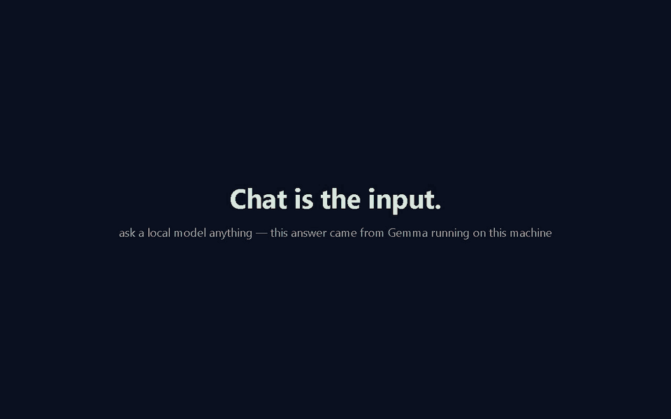
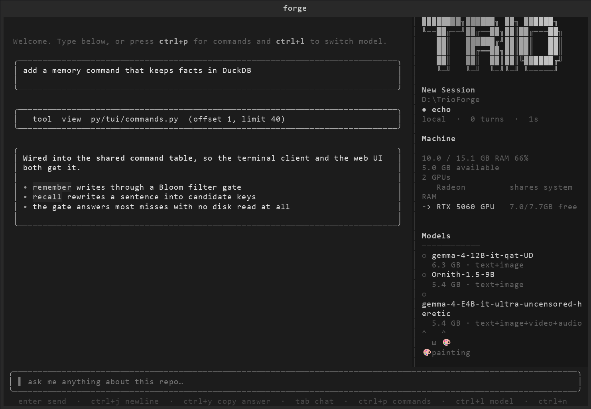

# ⚙️ TrioForge

> ### Chat is the input. The board is the output.
>
> A **self-hosted AI workspace where a conversation becomes something you keep**: send any answer to the corkboard, let the model rewrite it there, link it to what you already know. Chat, notes and pins live in one app, on your machine — offline-first, free with local models, no account, no telemetry.



**What it does** — local + API models (Ollama, llama.cpp, Groq, DeepSeek, Claude, Gemini, OpenRouter), a file-editing coding agent with a live diff panel, a **full-screen terminal client (`trioforge`)** with its own agent and file tools, full-text search over every message, export/import, local voice-to-voice, document chat (RAG), image/video generation — on Windows / macOS / Linux / WSL / Docker, installable on your phone.

**How it opens** — double-click **`TrioForge.bat`** (Windows) or run **`./run.sh`** (Linux/macOS/WSL): the server starts hidden and the app opens in your browser. Add **`--window`** for a real window of its own. There is **no `.exe` to download** — it's the repo (or Docker), so nothing to install and no SmartScreen dialog.

[](https://opensource.org/licenses/MIT)
[](https://www.python.org/)

**Jump to:** [Start](#-start) · [Quick start](#-quick-start) · [Model folders](#-model-folders) · [Terminal client](#-the-terminal-client--forge) · [Features](#-features) · [Configuration](#-configuration) · [Workspaces](#-workspaces--folder-access) · [Generation](#-image-video--audio-generation) · [Remote access](#-remote-access) · [Docker](#-docker) · [Your data](#-where-your-data-lives) · [Project structure](#-project-structure)

---

## 🆕 What's new in 1.4 — cross-platform, end to end

**1.4 makes local AI work on whichever machine you sit down at** — Apple, Windows or Linux — with nothing to download and nothing to compile:

- **Hardware is detected, not assumed** — Apple Silicon (Metal), NVIDIA (CUDA/Vulkan), AMD (ROCm/Vulkan), Intel (SYCL/Vulkan) via `llama-server --list-devices` first, then vendor APIs. It no longer *sums* an iGPU's shared RAM with the dGPU's VRAM.
- **llama.cpp is fetched for you** — the right prebuilt build for your OS + GPU is downloaded once and reused. `trioforge --install-llama` / `/llama` control it.
- **`py/llama_cpp.py`** — a stdlib-only `llama_cpp`, no `pip install llama-cpp-python` compile to fail. `python py/llama_cpp.py -p "2+2?"` auto-detects the model, the GPU layers and a free port.
- **The terminal client starts a local model on your first message** — no more "Connection refused" for forgetting `/start`. Pickers work with mouse and arrow keys; `ctrl+y` copies an answer; `ctrl+j` is a newline.
- **Every GPU is listed with its free VRAM and a verdict**, and RAM is reported like a task manager (used/total/%, plus available).
- **CI runs on real Windows and Apple-Silicon runners**, so "works on Windows/macOS" is executed on every push.

*(1.0.3 was the stability release: large attachments stream to disk, a bundled ffmpeg, 4× parallel transcription, a dark 7-theme UI, and a window that falls back to the browser when a GPU can't draw it.)*

---

## ⚡ Start

**Windows** — one file: `TrioForge.bat`.

```bash
git clone https://github.com/meowmeowsmh/TrioForge.git
cd TrioForge
./setup.sh            # first time: chmod +x setup.sh
```

**`./setup.sh` does the whole install**: it makes the venv, installs every
dependency (web app *and* terminal client), puts `forge` / `trioforge` on your
PATH and pre-fetches llama.cpp.

**Or skip it entirely — just run `./forge`.** It installs Python if you do not
have 3.10+, creates the venv, installs every library for *both* interfaces, and
starts. Nothing else to remember:

```
$ git clone https://github.com/meowmeowsmh/TrioForge.git && cd TrioForge
$ ./forge
forge: creating a virtual environment (.venv-linux)...
forge: installing dependencies (first run, or requirements changed)...
forge: dependencies ready — both interfaces are installed:
         terminal client   forge
         web app           ./run.sh    (then http://localhost:5003)
```

After that, a plain `git pull` is enough: `forge` re-installs by itself when a
requirement changes, and costs nothing (~0.2s) when nothing has.

Double-click **`TrioForge.bat`**. It opens in your browser, the server hidden behind it. Add **`--window`** for its own window (WebView2, ~600 MB) instead of a browser tab (~150–300 MB) — same server, same data; the window hands back to the browser automatically if your GPU can't draw it. It creates **`TrioForge`** (browser) and **`TrioForge (window)`** shortcuts per-user, no admin. Skip with `TRIOFORGE_NO_SHORTCUT=1`.

**Linux / macOS / WSL**

```bash
./run.sh              # first time: chmod +x run.sh
```

Then open **http://localhost:5003** (the app prints the exact URL).
`run.sh` installs the web dependencies itself, so `./setup.sh` is only needed
if you also want the `forge` terminal client on your PATH.

**Docker** — one line, if you already run Ollama:

```bash
docker run -d --name trioforge -p 5002:5001 \
  --add-host host.docker.internal:host-gateway \
  -e OLLAMA_BASE_URL=http://host.docker.internal:11434 \
  -v trioforge-data:/app/sqlite_data \
  -v trioforge-config:/app/json_configuration \
  ghcr.io/meowmeowsmh/trioforge:latest
```

Open **http://localhost:5002**. No Ollama yet? `docker run -d -p 11434:11434 ollama/ollama` then `docker exec ollama ollama pull llama3.2:3b`.

The launcher finds or installs **Python**, creates the venv and installs deps on first run — nothing else to set up.

---

## 🚀 Quick start

```bash
git clone https://github.com/meowmeowsmh/TrioForge.git
cd TrioForge
./run.sh              # Windows: double-click TrioForge.bat
```

<details>
<summary><strong>Prefer it by hand?</strong></summary>

```bash
python -m venv .venv
.venv\Scripts\activate              # Windows
source .venv/bin/activate           # Linux / macOS
python -m pip install --upgrade pip
python -m pip install -r requirements.txt
python -m pip install -r requirements-ml.txt   # optional: semantic RAG (~2 GB torch)
python py/app.py
```

Always `python -m pip`, never bare `pip` (which can target a different Python). No Python installed? The launcher installs it — see [INSTALL_PYTHON.md](INSTALL_PYTHON.md).
</details>

Then in the app: **🚀 Setup → ⚡ Auto-install** (llama.cpp) → **⬇** to download a model → pick it → type.

| Your OS | File | Local llama.cpp | Default URL |
|---|---|---|---|
| 🪟 Windows (browser) | `TrioForge.bat` | ⚡ Auto-install | `https://localhost:5003` |
| 🪟 Windows (window) | `TrioForge.bat --window` | ⚡ Auto-install | own window |
| 🐧 Linux | `run.sh` | ⚡ Auto-install | `http://localhost:5003` |
| 🍎 macOS | `run.sh` | `brew install llama.cpp` or ⚡ Auto-install | `http://localhost:5003` |
| 🐳 Docker | `docker/application.sh` | host llama-server via `LLAMA_HOST` | `http://localhost:5002` |

**First-run setup checker** (🚀 panel) detects what's present vs missing: Ollama (manual), llama.cpp (⚡ Auto-install), voice-to-voice (⚡ Install), GGUF models (⬇), ComfyUI (optional). Nothing is hand-configured — the GPU backend, `llama-server`, ffmpeg, ComfyUI and the port are all auto-located.

### ⬇ Download a model

**⬇** opens a browser that tags models against *your* hardware:

| Badge | Meaning |
|---|---|
| ✅ GPU | fits entirely in VRAM — fastest |
| ➗ Split | some layers on the GPU, rest in RAM |
| 🐌 RAM | CPU only |
| ❌ Too big | won't fit your free memory |

Search Hugging Face live, pick a repo, its `.gguf` files list best-quant-first (Q4_K_M → Q5 → Q6 → Q8 → f32), one-click download into `models/` (with an optional `mmproj` for vision models).

**Rule of thumb: keep the file under ~60% of your VRAM** so the KV cache and buffers still fit. A 7–8B Q4_K_M (~4.6 GB) is the sweet spot for an 8 GB card; a 12B Q4 (6.8 GB) already needs a GPU/CPU split.

Same thing via API: `GET /api/models/hardware` · `/api/models/recommended` · `/api/models/search?q=…` · `/api/models/files?repo_id=…` · `POST /api/models/download`.

---

## 🗂️ Model folders

llama.cpp loads a text `.gguf`; vision/video models also need a **projector** (`.gguf` with `mmproj` in its name) **in the same folder**. The folder name decides what input the model accepts — create the folder, drop the files in, done.

| Folder | Input it accepts |
|---|---|
| `models` | text, image |
| `video_model` | video only |
| `universal_models_to_text` | text, image, video, audio |

> ⚠️ Names are **exact**: `video_model` (singular), `universal_models_to_text` (underscores).

**Rules:** the projector sits next to the model (no name-matching) · the folder is the restriction (post a video to a `models/` model and you get a clear "can't read video" message) · any `mmproj` filename works · the dropdown lists every `.gguf` under all three roots recursively.

**Memory:** the GPU comes first (all layers offloaded when it fits); what won't fit is refused with an explanation; the model unloads 5 minutes after the last request (`TRIOFORGE_IDLE_UNLOAD=<seconds>`).

---

## ⌨️ The terminal client — `forge`

A full-screen terminal chat (Crush-style) that shares TrioForge's models and keys, plus a coding agent with file tools (`ls`, `view`, `write`, `edit`, `bash`, `grep`, `glob`, `todos`, `memory`), each drawn as its own card.



**`forge` and `trioforge` are the same program.** `trioforge` is a symlink to the `forge` launcher, and `--version` / `--help` print whichever name you typed. On Windows that symlink cannot survive a checkout — git writes it out as a plain text file — so Windows gets a `.cmd` shim for each name instead.

### Try it without installing anything

The launchers are already in the repo — run one straight from the folder:

| Your shell | Command |
|---|---|
| Linux · macOS · WSL | `./forge` — first time: `chmod +x forge` |
| Windows (PowerShell) | `.\forge.cmd` |
| Windows (cmd), or double-click it in Explorer | `forge.cmd` |

No launcher at all — it is just a Python module:

```bash
PYTHONPATH=py python3 -m tui         # Linux / macOS / WSL
set PYTHONPATH=py && python -m tui   # Windows cmd
$env:PYTHONPATH="py"; python -m tui  # Windows PowerShell
```

That route needs the four packages by hand: `python -m pip install rich prompt_toolkit textual duckdb`. The installers below do it for you.

### Install the command once

| Your machine | Command |
|---|---|
| Windows (PowerShell) | `powershell -ExecutionPolicy Bypass -File .\install.ps1` |
| Linux · macOS · WSL | `./install.sh` |

Both install `rich`, `prompt_toolkit`, `textual` and `duckdb` into the repo's own venv, then put the commands on your PATH:

- **Windows** writes `forge.cmd` and `trioforge.cmd` shims into `%USERPROFILE%\bin` and appends that folder to your **user** PATH — **open a new terminal** before `forge` resolves.
- **Linux / macOS** symlinks `forge` and `trioforge` into the first writable folder already on your PATH (`~/.local/bin`, `~/bin`, `~/.bin`), falling back to `~/.local/bin`, and prints the exact `export PATH=...` line to add if that folder is not on your PATH yet.

Neither needs admin, and both are safe to re-run. Both also fetch the prebuilt llama.cpp for your GPU (`TRIOFORGE_SKIP_LLAMA=1` skips that). If the packages cannot be installed, **nothing is linked, on purpose** — a `forge` that exists and then dies with `ModuleNotFoundError: textual` is worse than no launcher at all, which is why both scripts verify the imports before they link anything.

**`forge` not recognised?** Windows: open a *new* terminal (the PATH change only applies to new ones), or call it by full path — `& "$env:USERPROFILE\bin\forge.cmd"`. Linux/macOS: run `./forge` from the repo, or run the `export PATH=...` line the installer printed.

### Then just use it

```bash
forge                           # interactive session (identical to trioforge)
forge --echo                    # offline demo: no model contacted
forge --classic                 # plain scroll-back UI, no alternate screen
forge "explain this repo"       # one-shot
forge --specs                   # hardware that was detected, and what fits
forge --version                 # -> forge 1.4.0: the CLI prints the name you typed
```

Requires **Python 3.10+** (see `pyproject.toml`), and the client tracks the web app's version — **1.4.0**. The rest of the flags — `--provider`, `--model`, `--setup`, `--api-key`, `--system`, `--temperature`, `--timeout`, `--base-url`, `--no-banner`, `--install-llama` — are all in `forge --help`.

**llama.cpp is fetched for you** — the right prebuilt build downloads once on first use and is reused. `TRIOFORGE_NO_AUTO_INSTALL=1` disables it. The first message you send on a local model **starts the server automatically**.

**`py/llama_cpp.py`** — a stdlib-only `llama_cpp` (no compile), driving the same `llama-server` over HTTP:

```bash
python py/llama_cpp.py -p "2+2?" -n 40     # model, GPU and port all auto-detected
python py/llama_cpp.py --chat
```
```python
import llama_cpp            # PYTHONPATH=<project>/py
llm = llama_cpp.Llama()     # auto-finds the model
print(llm("Q: 2+2? A:", max_tokens=32)["choices"][0]["text"])
```

`--specs` reports CPU, RAM (task-manager style) and **every GPU with its free VRAM and a verdict** ("in use" / "usable, but shares system RAM"), plus a "can combine" answer for multi-GPU.

| Key | Action |
|---|---|
| `enter` | send |
| `ctrl+j` | new line |
| `ctrl+p` | command palette (also edits keys/models) |
| `ctrl+l` / `ctrl+o` | switch model / provider |
| `ctrl+y` | copy the last answer |
| `ctrl+a` | **auto-route**: send to local (llama.cpp) or cloud, decided by offline/complexity |
| `/team` | **senior/junior pair**: the local model works, the cloud model guides and takes over |
| `tab` / `ctrl+n` / `ctrl+q` | focus chat / new session / quit |

Shift+Enter can't work — a terminal sends the same byte as Enter — so `ctrl+j` is the newline key. Full details in [`py/tui/README.md`](py/tui/README.md).

**It remembers things between sessions.** `/memory` keeps durable facts in a local DuckDB vault with a Bloom filter gate in front of it, so a key that is definitely absent is answered from RAM without touching the disk:

```bash
/memory set my_port = 8080                 # store a fact
/memory recall what was my port again?     # sentence in, matching facts out
/memory                                    # keys, gate stats, recent entries
```

The agent gets the same thing as a tool, so "remember my llama port is 8080" works in plain English. Nothing leaves your machine, and the vault is `sqlite_data/memory.duckdb`.

**`/set token` caps the reply length and the context window:**

```bash
/set token                 # show the current limits
/set token 4096            # cap replies at 4096 tokens
/set token 4096 8192       # cap replies AND use an 8192-token context window
```

The reply cap takes effect on the very next message; the context window applies the next time the local model loads (it needs a llama-server restart). Defaults are 2048 output tokens and a 16384-token context — `0` falls back to the built-in default, and `TRIOFORGE_CTX_SIZE` still overrides the context for one-off runs.

---

## ✨ Features

- **Chat & models** — Ollama, llama.cpp, Groq, DeepSeek, Claude, Gemini, OpenRouter (one key → hundreds of models); multi-modal vision, file/image/PDF upload, persistent auto-save, personas, per-provider API keys, a local-vs-API badge, classified errors.
- **Agent & tools** — a folder-scoped coding agent (`list/search/read/write/edit/run` + `web_search`, up to 20 round-trips) with a live diff panel, optional full computer access, multi-agent (6 models) and A/B compare.
- **Knowledge** — Obsidian-style **Notes**, a **Corkboard** knowledge graph, document chat (RAG) over PDF/Word/Markdown/code.
- **Media** — image/video/audio generation (OpenRouter / Gemini / ComfyUI), video/audio → text, local voice-to-voice.
- **Find & keep** — FTS5 full-text search, Markdown/JSON export-import, auto titles.
- **Look & feel** — dark UI, seven themes + custom, one stylesheet across all three screens.
- **Run anywhere** — Windows/macOS/Linux/WSL/Docker, installable PWA, LAN + tunnel remote access, plugins, live RAM/VRAM monitor.

---

## ⚙️ Configuration

All optional environment variables; the app works out of the box.

| Variable | Purpose | Default |
|---|---|---|
| `TRIOFORGE_PORT` | App port (auto-picks the next free one if busy) | `5003` |
| `TRIOFORGE_SSL` | `1`=HTTPS, `0`=HTTP, unset=auto | *(auto)* |
| `TRIOFORGE_HOST` | Bind address; `0.0.0.0` opens to the LAN | `127.0.0.1` |
| `TRIOFORGE_PASSWORD` | **Host mode**: password-gate every page/API | *(unset)* |
| `TRIOFORGE_ML` | `1` = also install the optional torch/semantic stack | *(unset)* |
| `TRIOFORGE_AUTO_TITLE` | `heuristic` (instant) or `llm` (model-refined) | `heuristic` |
| `TRIOFORGE_CTX_SIZE` | llama.cpp context window (tokens) | `16384` |
| `TRIOFORGE_IDLE_UNLOAD` | Seconds idle before unloading a model; `0` keeps it | `300` |
| `TRIOFORGE_SKIP_RAM_CHECK` | `1` = load even if it won't fit in RAM | *(unset)* |
| `TRIOFORGE_KV_QUANT` | KV cache precision (`q8_0`, `f16`, …); split loads default to `q8_0` | *(auto)* |
| `TRIOFORGE_BASH_TIMEOUT` | Seconds a `bash` tool call may run — raise it for builds/installs | `120` |
| `TRIOFORGE_FFMPEG` | Explicit ffmpeg path (else `tools/ffmpeg`, then `PATH`) | *(auto)* |
| `TRIOFORGE_TRANSCRIBE_WORKERS` | Parallel audio chunks | `4` |
| `LLAMA_SERVER` | Explicit llama-server path | *(auto)* |
| `LLAMA_HOST` / `LLAMA_PORT` | llama-server host (set for Docker remote mode) / port | `127.0.0.1` / `8080` |
| `OLLAMA_BASE_URL` | Ollama server | `http://127.0.0.1:11434` |
| `GROQ_API_KEY` `DEEPSEEK_API_KEY` `ANTHROPIC_API_KEY` `OPENROUTER_API_KEY` `GEMINI_API_KEY` | Provider keys (also settable in the UI) | *(unset)* |
| `COMFYUI_URL` / `COMFYUI_INSTALL` | ComfyUI URL / explicit install path | `:8188` / *(auto)* |

Keys are never written to disk.

---

## 🎛️ Top-bar panels

| Button | Does |
|---|---|
| ⚔️ **Compare** | two models side-by-side on one prompt |
| 🤝 **Multi-agent** | up to 6 models in parallel |
| 📝 **Live coding** | every file edit / printed code as a colored diff (`sqlite_data/edits.db`) |
| 📚 **Documents** | RAG over uploaded PDF/Word/Markdown/code (keyword, or semantic with the ML stack) |
| 🧠 **Thinking** | live chain-of-thought for reasoning models |
| 🗣️ **Voice** | local speech-to-speech, plus 🎤/🔊 |
| 📺 **Video & audio → text** | frames (vision) or 4-at-a-time transcription (audio) |
| 🚀 **Setup** | first-run checker + installers |
| 💾 **Monitor** | live RAM/VRAM |

---

## 🗂️ Workspaces & folder access

A workspace scopes a model to one folder (read or read/write) with a thinking-effort hint. Tools: `list_files`, `search_files`, `read_file`, `write_file`, `edit_file` (surgical, unique-match), `run_command` (30 s cap). Paths are resolved against the folder and `..` traversal is blocked.

**Full computer access** (opt-in): `open_url`, `open_app`, `type_text`, `press_keys`, `screenshot` — needs `pyautogui` for typing/keys/screenshots. Only enable it for a task you trust.

---

## 🔎 Search, export & titles

- **FTS5 search** over every message, ranked + highlighted, prefix-match, click-to-jump, `LIKE` fallback.
- **Export** a chat (⬇, Alt-click = JSON) or everything (Markdown/JSON); **import** is non-destructive (new ids).
- **Titles** are generated on the first exchange (instant by default, model-refined with `TRIOFORGE_AUTO_TITLE=llm`).

---

## 🎬 Image, video & audio generation

| Panel | Backends |
|---|---|
| 🖼️ Images | OpenRouter (52 models), Gemini (Nano Banana / Imagen), ComfyUI (free & offline) |
| 🎬 Videos | OpenRouter (Kling, Veo 3…), ComfyUI (Wan/LTX, VRAM-hungry) |
| 🎵 Audio | ComfyUI workflows |

**ComfyUI is optional** — cloud backends need nothing installed. Install ComfyUI Desktop ([comfy.org](https://www.comfy.org)) and the app finds it automatically; the one gotcha is missing custom nodes (install ComfyUI Manager → "Install Missing Custom Nodes"). `COMFYUI_URL` points it at a remote install.

---

## 🔒 HTTP vs HTTPS

Default: **plain HTTP on Linux/macOS, HTTPS on Windows** (mkcert auto-CA). `localhost` is already a secure context, so mic/clipboard work either way.

## 🌐 Remote access

The app listens on `127.0.0.1` only. To reach it from elsewhere:

```bash
TRIOFORGE_HOST=0.0.0.0 ./run.sh       # or ./run.sh --host  (adds a password)
cloudflared tunnel --url http://localhost:5003   # or: ngrok http 5003
```

It's an installable **PWA** (Android/iOS/desktop). **Host mode** (`--host`, or `TRIOFORGE_PASSWORD=…`) password-gates everything except the login page. **Plugins** drop into `plugins/` and load on start. The default model is uncensored by default; swap freely.

---

## 🔄 Staying up to date

Every launcher checks for a new version on start and applies it before the app comes up — your data is never part of an update (local edits are stashed, not lost).

```bash
launcher.py --status / --update / --no-update / --force-update / --verify
TrioForge.bat --install-autostart      # also: ./run.sh --install-autostart
```

**🛡️ Is my copy untouched?** The 🛡️ button (or `launcher.py --verify`) hashes the app's own files against `integrity-manifest.json` and scans for injected-code fingerprints (`eval`, `atob`, `new Function`, long base64, `curl | sh`…). **0 % = nothing changed.** After your own edits, `--verify-baseline` re-records the baseline.

---

## 🐳 Docker

Recommended for a Linux server / WSL2 / NAS. The prebuilt image (CI-built on every push) is the one-liner at the top. From a clone: `./docker/application.sh` (checks Docker, creates host folders, builds, starts). Host llama.cpp runs in **remote mode** via `LLAMA_HOST=host.docker.internal`; ComfyUI and Ollama likewise run on the host. See the [Start](#-start) section for the exact commands.

---

## 💾 Backing up

`./backup.sh` packs the whole app — source, your settings and chat/notes data —
into one tarball under `backups/`, leaving out the multi-GB model weights, the
venv and the auto-fetched llama.cpp (all re-downloadable). `./backup.sh --all`
adds uploads and generated media; restore with `./backup.sh --restore <file>`.
The archive contains your API keys, so `backups/` is git-ignored and never pushed.

## 🗂️ Where your data lives

| Path | Contents |
|---|---|
| `json_configuration/` | conversations, notes, model config |
| `sqlite_data/` | SQLite DBs (chat, notes, corkboard, RAG, edits) |
| `static/uploads/` | uploaded files & generated media |
| `cert_store/` | auto SSL certs (`TRIOFORGE_SSL=1`) |
| `logs/` | `server.log` + `llamacpp.log` |
| `tools/llama.cpp/` | auto-installed llama.cpp builds |

All git-ignored. **Model weights are never committed** (`/models/`, `*.gguf`, `*.safetensors`, …).

---

## 🧱 Project structure

```
TrioForge/
├── py/                       # all Python
│   ├── app.py                # Flask app + chat/routes
│   ├── llamacpp_service.py   # llama-server lifecycle + GPU resolution
│   ├── llama_installer.py    # ⚡ auto-install llama.cpp
│   ├── setup_check.py        # GPU backend detection
│   ├── hardware.py           # cross-platform CPU/RAM/GPU detection
│   ├── llama_cpp.py          # stdlib-only llama_cpp (terminal)
│   ├── providers/ · features/ · tools/   # providers, notes/corkboard, launcher/updater/window/voice
│   └── tui/                  # the terminal client (forge/trioforge)
├── docker/                   # Dockerfile, compose, application.sh
├── .github/workflows/        # CI incl. real Windows + Apple Silicon smoke tests
├── templates/ · static/      # frontend
├── TrioForge.bat · run.sh    # launchers (Windows / Linux-macOS-WSL)
├── models/ · video_model/ · universal_models_to_text/   # your GGUFs (git-ignored)
└── requirements.txt · requirements-ml.txt · pyproject.toml · README.md · LICENSE
```

---

## 📄 License

Released under the [MIT License](LICENSE).
